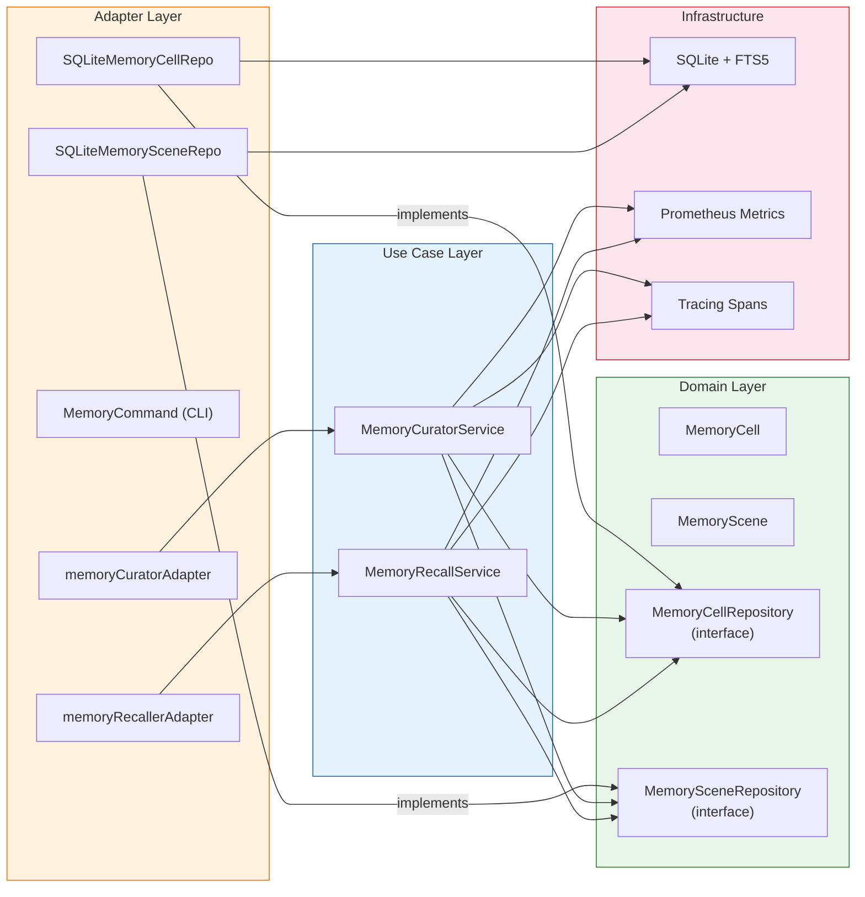

# NuimanBot Technical Documentation

**Version:** 1.1
**Last Updated:** 2026-03-22
**Completion Status:** 100% Complete
**CI/CD Status:** ✅ All Pipelines Passing

---

## Table of Contents

1. [Architecture Overview](#architecture-overview)
2. [System Design](#system-design)
3. [Performance Features](#performance-features)
4. [Security Architecture](#security-architecture)
5. [Observability & Monitoring](#observability--monitoring)
6. [Data Flow](#data-flow)
7. [Self-Organizing Memory v2](#self-organizing-memory-v2)
8. [API Documentation](#api-documentation)
9. [MCP Client Architecture](#mcp-client-architecture)
10. [REST API Security Architecture](#rest-api-security-architecture)
11. [TLS Auto-Generation Architecture](#tls-auto-generation-architecture)
12. [Web Admin Security Architecture](#web-admin-security-architecture)
13. [Ingatan Memory Backend Architecture](#ingatan-memory-backend-architecture)
14. [Configuration](#configuration)
15. [Testing Strategy](#testing-strategy)
16. [CI/CD Pipeline](#cicd-pipeline)
17. [Deployment Architecture](#deployment-architecture)

---

## Architecture Overview

### Clean Architecture Principles

NuimanBot follows **Clean Architecture** with strict dependency inversion:

```
┌─────────────────────────────────────────────────┐
│  Infrastructure Layer                           │
│  • LLM Clients (Anthropic, OpenAI, Bedrock, Ollama) │
│  • Encryption (AES-256-GCM) + TLS cert gen     │
│  • Caching (In-memory LRU)                      │
│  • Metrics (Prometheus)                         │
│  • External APIs (Weather, Search)              │
│  • Storage (file-based + Ingatan HTTP client)   │
│  • MCP transports (HTTP, stdio)                 │
└────────────┬────────────────────────────────────┘
             │ implements interfaces
┌────────────▼────────────────────────────────────┐
│  Adapter Layer                                  │
│  • CLI Gateway                                  │
│  • Telegram Gateway                             │
│  • Slack Gateway                                │
│  • Web Admin Server (TLS, session auth, RBAC)  │
│  • REST API Server (JWT, rate limiting)         │
│  • MCP Tool Bridge (MCPToolAdapter)             │
│  • File Repositories (Users, Messages, Notes)   │
│  • Memory Factory (backend selector)            │
└────────────┬────────────────────────────────────┘
             │ implements interfaces
┌────────────▼────────────────────────────────────┐
│  Use Case Layer                                 │
│  • Chat Service (orchestration)                 │
│  • Tool Execution Service (RBAC)               │
│  • Security Service (validation, audit)         │
│  • User Management                              │
│  • Memory v2 (MemoryCuratorService, MemoryRecallService) │
└────────────┬────────────────────────────────────┘
             │ uses entities
┌────────────▼────────────────────────────────────┐
│  Domain Layer                                   │
│  • Entities (User, Message, Conversation)       │
│  • Memory v2 Entities (MemoryCell, MemoryScene) │
│  • Interfaces (LLMService, SkillRegistry,       │
│    MemoryCellRepository, MemorySceneRepository) │
│  • Business Rules                               │
│  • Zero external dependencies                   │
└─────────────────────────────────────────────────┘
```

**Key Principles:**
- Dependencies flow inward (outer layers depend on inner)
- Inner layers define interfaces; outer layers implement them
- Domain layer has zero external dependencies (stdlib only)
- All dependencies are injected via constructors

---

## System Design

### Core Components

#### 1. Chat Service (`internal/usecase/chat/service.go`)

**Responsibilities:**
- Message processing orchestration
- LLM interaction with tool calling
- Conversation history management
- Context window optimization
- Response caching

**Architecture:**
```go
type Service struct {
    llmService       LLMService
    memoryRepo       MemoryRepository
    skillExecService SkillExecutionService
    securityService  SecurityService
    cache            LLMCache  // Optional
}
```

**Message Processing Flow:**
1. Input validation (security service)
2. Load conversation history (memory repository)
3. List available tools (tool service)
4. Prepare LLM request with tools
5. **Tool calling loop** (max 5 iterations):
   - Call LLM
   - If tool calls: execute and add results to conversation
   - If no tool calls: final response
6. **Cache final response** (if cache configured)
7. Save messages to memory
8. Return response

**Context Window Management:**
```go
func (s *Service) BuildContextWindow(
    ctx context.Context,
    conversationID string,
    provider domain.LLMProvider,
    maxTokens int,
) ([]domain.Message, int)
```

- Provider-aware limits: Anthropic (200k), OpenAI (128k), AWS Bedrock (200k), Ollama (32k)
- Automatic truncation of oldest messages
- Reserved tokens for response generation (2000)

**Conversation Summarization:**
```go
func (s *Service) SummarizeConversation(
    ctx context.Context,
    conversationID string,
    maxTokens int,
) (string, error)
```

- Uses Claude Haiku (cost-optimized)
- Preserves key facts, dates, numbers, decisions
- System prompt emphasizes factual summarization

#### 2. Tool Execution Service (`internal/usecase/tool/service.go`)

**Responsibilities:**
- Tool registration and discovery
- RBAC enforcement (role-based access control)
- Rate limiting integration
- Tool execution with timeout
- Audit logging

**RBAC Model:**
```go
type Role string

const (
    RoleGuest Role = "guest"  // No tools
    RoleUser  Role = "user"   // Basic tools
    RoleAdmin Role = "admin"  // All tools
)

// Permissions hierarchy
var SkillPermissions = map[string]Role{
    "calculator": RoleUser,
    "datetime":   RoleUser,
    "weather":    RoleUser,
    "websearch":  RoleUser,
    "notes":      RoleUser,
}
```

**Rate Limiting:**
```go
func (s *Service) ExecuteWithUser(
    ctx context.Context,
    user *domain.User,
    skillName string,
    params map[string]any,
) (*domain.SkillResult, error)
```

- Token bucket algorithm
- Per-user, per-tool limits
- Configurable requests/window
- Audit on rate limit exceeded

#### 3. Security Service (`internal/usecase/security/service.go`)

**Responsibilities:**
- Input validation (length, null bytes, UTF-8, injection attacks)
- Audit logging
- (Future: Encryption operations)

**Input Validation:**
```go
func (s *Service) ValidateInput(
    ctx context.Context,
    input string,
    maxLength int,
) (string, error)
```

- Length enforcement (configurable, default 4096)
- Null byte detection
- UTF-8 validation
- Prompt injection pattern matching (30+ patterns)
- Command injection pattern matching (50+ patterns)

**Categorized Errors:**
```go
type ErrorCategory string

const (
    ErrorCategoryUser     ErrorCategory = "user_error"      // 4xx
    ErrorCategorySystem   ErrorCategory = "system_error"    // 5xx
    ErrorCategoryExternal ErrorCategory = "external_error"  // External service
    ErrorCategoryAuth     ErrorCategory = "auth_error"      // 401/403
)
```

---

## Performance Features

### 1. Database Connection Pooling

**Configuration** (`cmd/nuimanbot/main.go`):
```go
db.SetMaxOpenConns(25)  // Max concurrent connections
db.SetMaxIdleConns(5)   // Idle connection pool
db.SetConnMaxLifetime(5 * time.Minute)  // Recycle connections
db.SetConnMaxIdleTime(1 * time.Minute)  // Close idle connections
```

**Rationale:**
- SQLite has single-writer concurrency model
- 25 max open prevents connection exhaustion
- 5 idle connections provide immediate availability
- Lifecycle management prevents stale connections

**Monitoring:**
```go
stats := db.Stats()
// Returns: OpenConnections, InUse, Idle, WaitCount, WaitDuration
```

### 2. LLM Response Caching

**Implementation** (`internal/infrastructure/cache/llm_cache.go`):
```go
type LLMCache struct {
    entries   map[string]*cacheEntry
    maxSize   int           // 1000 entries
    ttl       time.Duration // 1 hour
    mu        sync.RWMutex
    hits      uint64
    misses    uint64
    evictions uint64
}
```

**Cache Key Generation:**
- SHA256 hash of normalized prompt
- Normalization: trim whitespace
- Case-sensitive matching

**Eviction Policy:**
- **Size-based**: LRU (oldest entry by expiration time)
- **Time-based**: TTL expiration (1 hour default)

**Cache Statistics:**
```go
stats := cache.Stats()
// Returns: Size, Hits, Misses, Evictions, HitRate
```

**Test Coverage:** 100% (10 comprehensive tests)

### 3. Message Batching

**Implementation** (`internal/adapter/repository/sqlite/batcher.go`):
```go
type MessageBatcher struct {
    buffer        []messageItem
    maxSize       int           // 100 messages
    flushInterval time.Duration // 5 seconds
    ticker        *time.Ticker
    flushCh       chan struct{}
    mu            sync.Mutex
}
```

**Dual Flush Strategy:**
- **Size-based**: Flush when buffer reaches 100 messages
- **Time-based**: Periodic flush every 5 seconds

**Graceful Shutdown:**
```go
func (b *MessageBatcher) Stop() {
    close(b.stopCh)
    b.wg.Wait()
    b.Flush(context.Background())  // Final flush
}
```

---

## Security Architecture

### Encryption & Secrets

**Credential Vault** (`internal/infrastructure/crypto/file_credential_vault.go`):
- **Algorithm**: AES-256-GCM (authenticated encryption)
- **Key Derivation**: 32-byte key from `NUIMANBOT_ENCRYPTION_KEY`
- **Storage**: `data/vault.enc` (JSON, encrypted)

**Secret Rotation** (`internal/infrastructure/crypto/versioned_vault.go`):
```go
type VersionedVault struct {
    keys           map[int][]byte  // version -> key
    currentVersion int
}
```

- **Multi-version support**: Store secrets with version prefix (4 bytes)
- **Graceful rotation**: Old keys remain valid during transition
- **Zero downtime**: No service restart required

**Encrypted Storage Format:**
```
[4-byte version][encrypted data][GCM tag]
```

### Audit Logging

**Audit Events:**
```go
type AuditEvent struct {
    Timestamp time.Time
    Action    string  // skill_execute, rate_limit_exceeded, etc.
    Resource  string
    Outcome   string  // success, failure, denied
    Details   map[string]any
}
```

**Logged Events:**
- Tool executions (success, failure, permission denied)
- Rate limit violations
- Input validation failures
- Security-relevant operations

### Input Validation

**Threat Protection:**
- **Prompt Injection**: 30+ patterns (instruction override, role manipulation)
- **Command Injection**: 50+ patterns (shell metacharacters, dangerous commands)
- **SQL Injection**: Parameterized queries (no raw SQL)
- **XSS**: N/A (no web UI, but input sanitized)

**Validation Layers:**
1. Length check (configurable max)
2. Null byte detection
3. UTF-8 validation
4. Pattern matching (regex-based)

### Phase 3 Advanced Features Architecture

#### 4. Subagent Execution Service (`internal/usecase/skill/subagent/`)

**Responsibilities:**
- Context forking with deep copy isolation
- Autonomous multi-step execution with LLM orchestration
- Resource limit enforcement (tokens, tool calls, timeout)
- Background execution management

**Architecture:**
```go
type SubagentExecutor struct {
    llmService    domain.LLMService
    toolService   domain.ToolExecutionService
    forker        *ContextForker
}

type LifecycleManager struct {
    executor       SubagentExecutor
    registry       map[string]*runningSubagent  // Thread-safe
    mu             sync.RWMutex
    monitoringHook func(string, domain.SubagentStatus)
}
```

**Context Forking:**
```go
func (f *ContextForker) Fork(
    original *domain.SubagentContext,
) (*domain.SubagentContext, error)
```

- Deep copy of conversation history (prevents cross-contamination)
- Deep copy of allowed tools (independent tool restrictions)
- Proper timestamp initialization
- Metadata preservation

**Autonomous Execution Loop:**
```go
func (e *SubagentExecutor) Execute(
    ctx context.Context,
    subagentCtx *domain.SubagentContext,
) (*domain.SubagentResult, error)
```

1. Validate resource limits
2. **Multi-step loop** (max iterations based on tool call limit):
   - Call LLM with conversation history and allowed tools
   - Check token usage against limit
   - If tool calls requested:
     - Execute tools (enforcing restrictions)
     - Add tool results to conversation
     - Increment tool call counter
   - If no tool calls: final response achieved
3. Aggregate results with step tracking
4. Return SubagentResult with conversation, steps, resource usage

**Thread-Safe Lifecycle Management:**
- RWMutex for concurrent access to registry
- Start: Spawn goroutine, register in map
- Cancel: Context cancellation, graceful shutdown
- GetStatus: Read-only access with RLock
- ListRunning: Snapshot of all running subagents
- Shutdown: 30s timeout for cleanup

**Performance:**
- Context forking: ~50 ns/op (deep copy efficiency)
- Lifecycle operations: ~5.86 ms/op
- Concurrent execution: 10 agents in ~11.77 ms

#### 5. Preprocessing Infrastructure (`internal/infrastructure/skill/` & `internal/infrastructure/preprocess/`)

**Responsibilities:**
- Parse !command blocks from SKILL.md files
- Execute commands in security sandbox
- Substitute command outputs into skill templates

**Parser Architecture:**
```go
type PreprocessParser struct{}

func (p *PreprocessParser) Parse(content string) ([]domain.PreprocessCommand, error)
```

- Scans for `!command` markers using bufio.Scanner
- Extracts commands until `!end` or empty line
- Returns slice of PreprocessCommand entities

**Sandbox Architecture:**
```go
type CommandSandbox struct {
    whitelist  []string  // git, gh, ls, cat, grep
    timeout    time.Duration  // 5 seconds
    maxOutput  int  // 10KB
}

func (s *CommandSandbox) Execute(
    ctx context.Context,
    cmd domain.PreprocessCommand,
) (*domain.CommandResult, error)
```

**Security Constraints:**
1. **Whitelist enforcement**: Only git, gh, ls, cat, grep allowed
2. **Shell metacharacter blocking**: Reject |, ;, &, $, `, >, <, ||, &&
3. **Timeout enforcement**: Kill after 5 seconds
4. **Output limiting**: Truncate at 10KB
5. **Working directory restriction**: Configurable working directory

**Renderer Integration:**
```go
type PreprocessRenderer struct {
    parser     *PreprocessParser
    sandbox    *CommandSandbox
    baseRenderer *SkillRenderer
}

func (r *PreprocessRenderer) Render(
    ctx context.Context,
    skill *domain.Skill,
    args []string,
) (*domain.RenderedSkill, error)
```

**Two-phase rendering:**
1. Execute preprocessing commands, collect outputs
2. Apply argument substitution with command results

#### 6. Plugin Discovery & Management (`internal/infrastructure/plugin/` & `internal/usecase/plugin/`)

**Responsibilities:**
- Scan filesystem for plugin manifests
- Parse plugin.yaml files
- Validate plugin security constraints
- Manage plugin lifecycle

**Discovery Architecture:**
```go
type PluginDiscovery struct {
    baseDir string  // e.g., data/plugins/
}

func (d *PluginDiscovery) Scan(
    ctx context.Context,
    pluginDir string,
) ([]*domain.Plugin, error)
```

**Scanning Process:**
1. Walk directory tree looking for plugin.yaml files
2. Parse YAML manifest for each plugin
3. Validate namespace format (org/skill-name)
4. Detect namespace collisions
5. Return slice of Plugin entities

**Security Validation:**
```go
func ValidatePluginSecurity(manifest *domain.PluginManifest) error
```

- Reserved word check (nuimanbot, system, admin, internal)
- Namespace format validation (must contain /)
- Dependency limit (max 10 dependencies)
- Circular dependency detection

**Plugin Manager:**
```go
type PluginManager struct {
    discovery *PluginDiscovery
    registry  domain.PluginRegistry
}

func (m *PluginManager) Install(pluginPath string) error
func (m *PluginManager) Uninstall(namespace string) error
func (m *PluginManager) Enable(namespace string) error
func (m *PluginManager) Disable(namespace string) error
```

#### 7. Version Resolution (`internal/infrastructure/skill/version.go` & `internal/usecase/skill/version_manager.go`)

**Responsibilities:**
- Parse semantic versions (x.y.z format)
- Compare versions for ordering
- Resolve version constraints (^, ~, =)

**Version Architecture:**
```go
type SkillVersion struct {
    Major int
    Minor int
    Patch int
    Pre   string   // Optional pre-release (e.g., -alpha.1)
    Build string   // Optional build metadata (e.g., +20130313144700)
}

func ParseVersion(v string) (*SkillVersion, error)
func (v *SkillVersion) Compare(other *SkillVersion) int  // -1, 0, 1
```

**Version Constraints:**
```go
type VersionConstraint struct {
    Operator string       // ^, ~, =, >=, <=, <, >
    Version  *SkillVersion
}

func (c *VersionConstraint) Satisfies(v *SkillVersion) bool
```

**Constraint Semantics:**
- Caret (^1.2.3): >=1.2.3 <2.0.0 (compatible with 1.x.x)
- Tilde (~1.2.3): >=1.2.3 <1.3.0 (compatible with 1.2.x)
- Exact (1.2.3): ==1.2.3 (exact match only)

#### 8. Memory Storage (`internal/infrastructure/memory/storage.go` & `internal/usecase/skill/memory_api.go`)

**Responsibilities:**
- Persist skill memory in SQLite database
- Support multiple scopes (skill, user, global, session)
- Automatic expiration and cleanup

**Storage Architecture:**
```go
type SQLiteMemoryStorage struct {
    db *sql.DB
}

func (s *SQLiteMemoryStorage) Set(memory *domain.SkillMemory) error
func (s *SQLiteMemoryStorage) Get(skillName, key string, scope domain.MemoryScope) (*domain.SkillMemory, error)
func (s *SQLiteMemoryStorage) Delete(skillName, key string, scope domain.MemoryScope) error
func (s *SQLiteMemoryStorage) List(skillName string, scope domain.MemoryScope) ([]*domain.SkillMemory, error)
func (s *SQLiteMemoryStorage) Cleanup() error  // Remove expired entries
```

**Database Schema:**
```sql
CREATE TABLE skill_memory (
    skill_name TEXT NOT NULL,
    scope TEXT NOT NULL,
    key TEXT NOT NULL,
    value TEXT NOT NULL,  -- JSON serialized
    created_at TIMESTAMP NOT NULL,
    expires_at TIMESTAMP,
    PRIMARY KEY (skill_name, scope, key)
);

CREATE INDEX idx_expires_at ON skill_memory(expires_at);
```

**Memory API:**
```go
type MemoryAPI struct {
    storage domain.MemoryQuery
}

func (api *MemoryAPI) Remember(skillName, key string, value interface{}, scope domain.MemoryScope) error
func (api *MemoryAPI) Recall(skillName, key string, scope domain.MemoryScope, dest interface{}) error
func (api *MemoryAPI) Forget(skillName, key string, scope domain.MemoryScope) error
```

**JSON Serialization:**
- Values serialized with `json.Marshal(value)`
- Values deserialized with `json.Unmarshal([]byte(memory.Value), dest)`
- Supports any JSON-serializable type

**Memory Scopes:**
- `MemoryScopeSkill`: Isolated per skill
- `MemoryScopeUser`: Isolated per user (future)
- `MemoryScopeGlobal`: Shared across all invocations
- `MemoryScopeSession`: Temporary, session-specific

---

## Observability & Monitoring

### Prometheus Metrics

**Endpoint:** `GET /metrics`

**Metric Categories:**

**1. HTTP Metrics:**
```prometheus
http_requests_total{method, path, status}
http_request_duration_seconds{method, path}
```

**2. LLM Metrics:**
```prometheus
llm_requests_total{provider, model, status}
llm_request_duration_seconds{provider, model}
llm_tokens_used_total{provider, model, type}
llm_cost_usd_total{provider, model}
```

**3. Tool Metrics:**
```prometheus
skill_executions_total{tool, status}
skill_execution_duration_seconds{tool}
```

**4. Cache Metrics:**
```prometheus
cache_hits_total{cache_type="llm"}
cache_misses_total{cache_type="llm"}
cache_evictions_total{cache_type="llm"}
```

**5. Database Metrics:**
```prometheus
db_queries_total{operation, status}
db_query_duration_seconds{operation}
db_connections_open
db_connections_idle
```

**6. Security Metrics:**
```prometheus
rate_limit_exceeded_total{user_id, action}
security_validation_failures_total{reason}
audit_events_total{action, outcome}
```

### Health Checks

**Endpoints:**

| Endpoint | Purpose | Kubernetes |
|----------|---------|------------|
| `GET /health` | Liveness probe | `livenessProbe` |
| `GET /health/ready` | Readiness probe | `readinessProbe` |
| `GET /health/version` | Version info | N/A |

**Readiness Checks:**
- Database connectivity
- LLM provider availability
- Credential vault accessibility

### Request Tracing

**Request ID Propagation:**
```go
// Generate request ID
ctx, reqID := requestid.MustFromContext(ctx)

// Log with request ID
logger := requestid.Logger(ctx)
logger.Info("Processing message", "platform", platform)
```

**Request ID Format:** SHA256 hash (first 32 chars)

**Propagation:** Context-based throughout request lifecycle

---

## Data Flow

### Message Processing Pipeline

```
1. User Input
   │
   ├─> [CLI Gateway] or [Telegram Gateway] or [Slack Gateway]
   │
2. IncomingMessage
   │
   ├─> [Security Service] ValidateInput()
   │   ├─ Length check
   │   ├─ Null byte detection
   │   ├─ UTF-8 validation
   │   └─ Injection pattern matching
   │
3. Validated Input
   │
   ├─> [Chat Service] ProcessMessage()
   │   ├─ Load conversation history
   │   ├─ List available tools (RBAC filtered)
   │   ├─ Build context window (provider-aware)
   │   ├─ Check cache (if configured)
   │   ├─ Call LLM (with tools)
   │   │   └─ [Tool Calling Loop]
   │   │       ├─ Execute tools via SkillExecutionService
   │   │       ├─ Check rate limits (per-user, per-tool)
   │   │       ├─ Audit tool execution
   │   │       └─ Format tool results
   │   ├─ Cache final response
   │   └─ Save messages (batched)
   │
4. OutgoingMessage
   │
   └─> Gateway Response
```

### Database Schema

**Tables:**

```sql
-- Conversations
CREATE TABLE conversations (
    id TEXT PRIMARY KEY,
    user_id TEXT NOT NULL,
    platform TEXT NOT NULL,
    created_at TIMESTAMP,
    updated_at TIMESTAMP
);

-- Messages
CREATE TABLE messages (
    id TEXT PRIMARY KEY,
    conversation_id TEXT NOT NULL,
    role TEXT NOT NULL,  -- user, assistant
    content TEXT NOT NULL,
    timestamp TIMESTAMP,
    token_count INTEGER,
    FOREIGN KEY (conversation_id) REFERENCES conversations(id)
);

-- Users
CREATE TABLE users (
    id TEXT PRIMARY KEY,
    role TEXT NOT NULL,  -- guest, user, admin
    allowed_skills TEXT,  -- JSON array
    created_at TIMESTAMP,
    updated_at TIMESTAMP
);

-- Notes
CREATE TABLE notes (
    id TEXT PRIMARY KEY,
    user_id TEXT NOT NULL,
    title TEXT NOT NULL,
    content TEXT NOT NULL,
    tags TEXT,  -- JSON array
    created_at TIMESTAMP,
    updated_at TIMESTAMP,
    FOREIGN KEY (user_id) REFERENCES users(id)
);

-- Skill Memory (Phase 3E)
CREATE TABLE skill_memory (
    skill_name TEXT NOT NULL,
    scope TEXT NOT NULL,      -- skill, user, global, session
    key TEXT NOT NULL,
    value TEXT NOT NULL,      -- JSON serialized
    created_at TIMESTAMP NOT NULL,
    expires_at TIMESTAMP,     -- NULL = no expiration
    PRIMARY KEY (skill_name, scope, key)
);

CREATE INDEX idx_skill_memory_expires ON skill_memory(expires_at);
CREATE INDEX idx_skill_memory_scope ON skill_memory(scope);
```

**Migrations:** Automatically applied on startup via `schema.sql`

### Self-Organizing Memory v2

NuimanBot includes a self-organizing long-term memory system that automatically extracts, organizes, and recalls knowledge across conversations. The system uses a "scene + cell" architecture where individual knowledge units (cells) are organized into topic buckets (scenes) with consolidated summaries.

#### Architecture Overview

The memory system follows Clean Architecture with four layers:



**Source diagrams:** `documentation/diagrams/memory-*.mmd`

#### Memory Cell Types

| Type | Description | Example |
|------|-------------|---------|
| `fact` | Objective information or observations | "User's project uses Go 1.22" |
| `decision` | Choices made or preferences expressed | "Decided to use JWT with 24h expiry" |
| `task` | Action items, TODOs, or goals | "Need to implement rate limiting" |
| `preference` | User preferences or patterns | "User prefers TDD workflow" |
| `plan` | Future plans or strategies | "Will migrate to PostgreSQL in Q3" |
| `risk` | Warnings, concerns, or issues | "API rate limit may be hit at scale" |

#### Memory Extraction Flow

After each chat interaction, the curator service extracts structured memory:

```
ChatService.ProcessMessage()
    → memoryCuratorAdapter.ExtractMemoryCells()
        → MemoryCuratorService.ExtractCells()
            1. Build extraction prompt with interaction context
            2. Call LLM (GenerateJSON) for structured extraction
            3. Parse response into ExtractedCell array
            4. For each cell: validate, persist to memory_cells table
               (FTS5 trigger auto-indexes content)
            5. For each touched scene: consolidate summary
                → Call LLM for scene summary
                → Upsert into memory_scenes table
```

#### Memory Recall Flow

When building context for a new conversation turn:

```
ChatService / BuildContextWindow
    → memoryRecallerAdapter.RecallAndFormat()
        → MemoryRecallService.RecallMemory()
            1. FTS5 full-text search (BM25 ranking, limit 20)
            2. If no FTS results: fallback to high-salience cells
            3. Fetch scene summaries for matched cells
            4. Apply token budget (cells + scenes fit within limit)
            5. Format as markdown for system prompt injection
```

Output format injected into context:
```markdown
### Relevant Long-Term Memory (Curated)

**Scene: authentication**
Summary: User configured OAuth2 with JWT tokens...

**Key Facts:**
- [decision, salience=0.90] Decided to use JWT with 24-hour expiry
- [fact, salience=0.85] OAuth2 provider is Auth0

*Retrieved 2 cells from 1 scenes (45 tokens)*
```

#### Memory Database Schema

```sql
-- Structured knowledge units
CREATE TABLE memory_cells (
    id TEXT PRIMARY KEY,              -- UUID
    conversation_id TEXT NOT NULL,    -- User/conversation (max 128)
    scene TEXT NOT NULL,              -- Topic bucket (3-64 chars)
    cell_type TEXT NOT NULL,          -- fact|decision|task|preference|plan|risk
    salience REAL NOT NULL,           -- Importance 0.0-1.0
    content TEXT NOT NULL,            -- Knowledge text (max 2000)
    source TEXT NOT NULL,             -- JSON array of message IDs
    created_at TIMESTAMP NOT NULL,
    updated_at TIMESTAMP NOT NULL,
    expires_at TIMESTAMP              -- Optional expiration
);

-- FTS5 full-text search index (auto-synced via triggers)
CREATE VIRTUAL TABLE memory_cells_fts USING fts5(
    content, scene, cell_type,
    content='memory_cells', content_rowid='rowid'
);

-- Consolidated scene summaries
CREATE TABLE memory_scenes (
    scene TEXT PRIMARY KEY,           -- Topic name (3-64 chars)
    summary TEXT NOT NULL,            -- Consolidated summary (max 10000)
    token_count INTEGER NOT NULL,     -- Summary tokens (1-2000)
    updated_at TIMESTAMP NOT NULL
);
```

**Indexes:** conversation_id, scene, salience DESC, expires_at, created_at DESC, (conversation_id, scene) composite.

**FTS5 Triggers:** Auto-sync on INSERT, UPDATE, DELETE from memory_cells to memory_cells_fts.

#### Memory Metrics (Prometheus)

| Metric | Type | Labels | Description |
|--------|------|--------|-------------|
| `memory_extraction_total` | Counter | status | Extraction operations (success/error/skipped) |
| `memory_extraction_duration_seconds` | Histogram | - | Extraction latency |
| `memory_cells_created_total` | Counter | - | Total cells created |
| `memory_consolidation_total` | Counter | status | Scene consolidations (success/error) |
| `memory_consolidation_duration_seconds` | Histogram | - | Consolidation latency |
| `memory_recall_total` | Counter | status, query_type | Recall operations (fts/fallback) |
| `memory_recall_duration_seconds` | Histogram | - | Recall latency |
| `memory_recall_cells_total` | Counter | - | Total cells recalled |
| `memory_fts_query_duration_seconds` | Histogram | - | FTS query latency |

#### Memory CLI Commands

| Command | Description |
|---------|-------------|
| `/memory list [--scene X] [--type Y] [--limit N]` | List memory cells with filters |
| `/memory get <id>` | Show full cell details |
| `/memory search <query> [--limit N]` | Full-text search across cells |
| `/memory delete <id>` | Delete a specific cell |
| `/memory scenes` | List all scene summaries |
| `/memory prune` | Delete expired cells |
| `/memory help` | Show available commands |

#### Graceful Degradation

- **Memory DB init failure:** App continues without memory v2 (logged warning)
- **Extraction LLM failure:** Error logged, chat continues normally
- **Recall failure:** Empty memory returned, response generated without memory context
- **Individual cell errors:** Collected in result.Errors, non-blocking

---

## API Documentation

### LLM Service Interface

```go
type LLMService interface {
    Complete(
        ctx context.Context,
        provider LLMProvider,
        req *LLMRequest,
    ) (*LLMResponse, error)

    Stream(
        ctx context.Context,
        provider LLMProvider,
        req *LLMRequest,
    ) (<-chan StreamChunk, error)

    ListModels(
        ctx context.Context,
        provider LLMProvider,
    ) ([]ModelInfo, error)
}
```

**Supported Providers:**
- `anthropic` - Claude 3/3.5 family (Opus, Sonnet, Haiku) via Anthropic API
- `openai` - GPT-4, GPT-3.5 via OpenAI API
- `bedrock` - Claude 3/3.5 family via AWS Bedrock (Converse API)
- `ollama` - Local models (Llama, Mistral, etc.)

### Tool Interface

```go
type Tool interface {
    Name() string
    Description() string
    InputSchema() map[string]any
    Execute(
        ctx context.Context,
        params map[string]any,
    ) (*SkillResult, error)
    RequiredPermissions() []Permission
    Config() SkillConfig
}
```

**Built-in Tools:**

**Core Tools (Infrastructure Layer):**
1. **Calculator**: `add`, `subtract`, `multiply`, `divide`
2. **DateTime**: `now`, `format`, `unix`
3. **Weather**: `current`, `forecast`
4. **WebSearch**: `search`
5. **Notes**: `create`, `read`, `update`, `delete`, `list`

**Developer Productivity Tools (Use Case Layer):**
6. **GitHub**: GitHub operations via `gh` CLI (`issue_create`, `issue_list`, `pr_create`, `pr_list`, `pr_review`, `pr_merge`, `repo_view`, `release_create`, `gist_create`, `workflow_run`, `workflow_list`, `repo_clone`)
7. **RepoSearch**: Fast codebase search using `ripgrep` with regex support, context lines, and file filtering
8. **DocSummarize**: LLM-powered document summarization with configurable detail levels
9. **Summarize**: Web page and YouTube video summarization with transcript extraction via `yt-dlp`
10. **CodingAgent**: Orchestrates external coding CLI tools (Codex, Claude Code, OpenCode, Gemini, Copilot) in PTY mode with workspace validation
11. **Executor**: Tool execution engine with RBAC, rate limiting, and orchestration
12. **Common**: Shared utilities for rate limiting, input sanitization, and validation

**Total: 12 Built-in Tools** (5 infrastructure + 7 use case) + dynamic MCP tools

---

## MCP Client Architecture

### Overview

The MCP (Model Context Protocol) client bridges external tool servers into NuimanBot's domain tool registry. It follows the same Clean Architecture layering as built-in tools.

### Transport Interface (`internal/infrastructure/mcp/`)

```go
type Transport interface {
    Send(ctx context.Context, method string, params json.RawMessage) (json.RawMessage, error)
}
```

Two implementations:
- **HTTPTransport**: JSON-RPC 2.0 over HTTP POST. Sends `{"jsonrpc":"2.0","method":...,"params":...,"id":N}`.
- **StdioTransport**: JSON-RPC 2.0 over subprocess stdin/stdout. Spawns `command args...` and communicates line-delimited JSON.

### MCPClient (`internal/infrastructure/mcp/client.go`)

```go
type MCPClient struct {
    transport    Transport
    serverName   string
    capabilities ServerCapabilities
    mu           sync.RWMutex
    initialized  bool
    idCounter    atomic.Int64  // Thread-safe request ID generation
}
```

**Methods:**
- `Initialize(ctx)` — Handshake with protocol version `2024-11-05`. Validates server returns same protocol version. Must be called before other methods.
- `ListTools(ctx)` — Returns `[]MCPTool` (name, description, inputSchema).
- `CallTool(ctx, name, args)` — Invokes tool; returns error if server returns `isError: true`.

### MCPToolAdapter (`internal/adapter/mcp/tool_bridge.go`)

Wraps an MCPClient + MCPTool and implements `domain.Tool`:

```go
type MCPToolAdapter struct {
    client     *infra.MCPClient
    toolDef    infra.MCPTool
    serverName string
    sanitizer  *common.OutputSanitizer
    timeout    time.Duration  // default 30s
}
```

- **Name**: `mcp:<serverName>:<toolName>`
- **RequiredPermissions**: `[domain.PermissionNetwork]` (all MCP calls involve network I/O to the server)
- **Execute**: Creates a deadline context (`30s`), calls `client.CallTool`, sanitizes output via `OutputSanitizer` before returning to prevent prompt injection from untrusted MCP servers.

### Startup Wiring (`cmd/nuimanbot/main.go`)

```
registerMCPTools(ctx, cfg, toolRegistry):
  for each server in mcp.json:
    create transport (HTTP or stdio)
    create MCPClient
    call Initialize — if error: log warning, skip server (non-fatal)
    call ListTools
    for each tool: register MCPToolAdapter in toolRegistry
```

Servers that fail to initialize are skipped. The bot continues with all successfully registered MCP tools plus built-in tools.

---

## REST API Security Architecture

### Server (`internal/adapter/api/server.go`)

The REST API server enforces a layered middleware stack on all protected routes:

```
BodyLimit(1 MiB) → JWT → RateLimit(per-client) → Validate(injection) → Handler
```

The auth endpoint (`POST /api/v1/auth/token`) has a lighter stack:

```
BodyLimit(1 MiB) → Validate(injection) → AuthHandler
```

### JWT Flow

1. Client calls `POST /api/v1/auth/token` with API key in request body.
2. `AuthHandler` validates the key and issues an HS256 JWT with `sub` set to the client identifier and an expiry claim.
3. JWT secret minimum: **32 bytes** — enforced at `NewServer` construction time (returns error if shorter).
4. Client includes `Authorization: Bearer <token>` on subsequent requests.
5. JWT middleware validates signature, expiry, and stores the `sub` claim in request context.
6. Rate limiter keys buckets by the JWT `sub` claim (per-client, not per-IP).

### Middleware Chain Details

| Middleware | Purpose | Config |
|-----------|---------|--------|
| BodyLimit | Caps request body at 1 MiB before any auth work | 1 MiB (1 << 20 bytes) |
| JWT | Validates HS256 Bearer token | Secret min 32 bytes |
| RateLimit | Per-client token bucket, keyed on JWT subject | 100 req/min per client |
| Validate | Scans JSON string fields for injection patterns | 80+ attack patterns |

Server timeouts: ReadTimeout 15s, WriteTimeout 15s, IdleTimeout 60s.

---

## TLS Auto-Generation Architecture

### LoadOrGenerateCert (`internal/infrastructure/crypto/cert.go`)

```go
func LoadOrGenerateCert(certPath, keyPath string, hosts []string) (tls.Certificate, error)
```

**Logic:**
1. If both `certPath` and `keyPath` exist on disk: load them with `tls.LoadX509KeyPair`.
2. Otherwise: generate a new self-signed certificate:
   - Algorithm: ECDSA P-256
   - Validity: 365 days from generation time
   - SANs: provided `hosts` (parsed as IP addresses or DNS names) plus `127.0.0.1`
   - Serial number: 128-bit cryptographically random
3. Write files: cert at mode 0644, key at mode 0600.
4. Return `tls.Certificate` for direct use with `tls.Config`.

### StartTLS Pattern

At startup, `LoadOrGenerateCert` is called for each server that needs TLS (health server, web admin server). The returned `tls.Certificate` is placed in a `tls.Config` and applied to the `http.Server`. The web `AuthService.setSecureCookies(true)` is called when TLS is active so session cookies carry the `Secure` flag.

---

## Web Admin Security Architecture

### Session-Based Authentication (`internal/adapter/web/auth.go`)

```go
type AuthService struct {
    users          map[string]*AuthUser
    sessions       map[string]*Session
    csrfTokens     map[string]bool
    mu             sync.RWMutex
    sessionTimeout time.Duration  // 24h
    secureCookies  bool
}
```

**Session lifecycle:**
- Session ID: 32-byte cryptographically random, base64-encoded
- Expiry: 24 hours from creation
- Cleanup: single background goroutine on 5-minute timer (prevents goroutine accumulation under load)
- Cookie flags: `HttpOnly`, `SameSite=Strict`, `Secure` (when TLS active)

### Login Rate Limiter

Per-IP token bucket. On successful authentication, the bucket for that IP is reset. Stale entries (IPs that have not been seen recently) are evicted periodically to bound memory growth.

### Default Credentials Detection

On login, `isDefaultCredentials(username, password)` checks if the submitted credentials match `admin`/`admin` using `bcrypt.CompareHashAndPassword` (constant-time). If matched, `Session.ForcePasswordChange = true` is set and the user is redirected to `/admin/change-password`. The CSRF token is consumed on every POST to prevent replay attacks.

### requireRole Middleware

Routes that require a specific role (e.g., admin-only pages) are wrapped with `requireRole("admin")`. The middleware reads the session from the cookie, checks `session.Role`, and returns HTTP 403 if insufficient.

---

## Ingatan Memory Backend Architecture

### IngatanHTTPClient (`internal/infrastructure/storage/ingatan_client.go`)

```go
type IngatanHTTPClient struct {
    baseURL     string
    httpClient  *http.Client       // 30s timeout
    tokenCache  *TokenCache        // JWT + expiry
    refreshMu   sync.Mutex         // Serializes token exchanges
    apiKey      string
    storePrefix string
}
```

**JWT token exchange:**
1. On first `Do()` call (or when token will expire within 5 minutes), acquires `refreshMu`.
2. Double-checked locking: re-tests `needsRefresh()` after acquiring lock (another goroutine may have already refreshed).
3. POSTs `{"api_key": "..."}` to `/auth/token`.
4. Validates response: non-empty token, RFC3339 `expires_at`, expiry must be in the future.
5. Stores token + expiry under `tokenCache.mu`.

**Ping:**
- `GET /api/v1/health` (unauthenticated) — used by memory factory health probe at startup.

### Backend Selector (`internal/adapter/factory/memory_factory.go`)

```go
func BuildMemoryRepositories(cfg *config.NuimanBotConfig) (
    memoryv2.MemoryCellRepository,
    memoryv2.MemorySceneRepository,
    error,
)
```

| `cfg.Memory.Backend` | Result |
|---------------------|--------|
| `"builtin"` or `""` | `FileMemoryCellRepository` + `FileMemorySceneRepository` |
| `"ingatan"` | `IngatanMemoryCellRepository` + `IngatanMemorySceneRepository` |

**Graceful degradation:** `BuildMemoryRepositoriesWithFallback` (called at startup) pings the Ingatan server. On failure, it logs a warning and falls back to built-in storage — chat functionality is never blocked.

**Store prefix validation:** `^[a-z0-9][a-z0-9-]{1,30}$` — validated at factory construction time; returns descriptive error if invalid.

---

## Configuration

### Environment Variables

**Naming Convention:** `NUIMANBOT_{SECTION}_{SUBSECTION}_{KEY}`

**Validation Rules:**
- **Development**: Relaxed (allows empty optional fields)
- **Staging**: Moderate (warns on missing optional fields)
- **Production**: Strict (requires all production settings)

**Example:**
```bash
NUIMANBOT_SERVER_ENVIRONMENT=production
NUIMANBOT_SERVER_LOGLEVEL=warn
NUIMANBOT_SECURITY_INPUTMAXLENGTH=4096

# LLM Provider Options:
NUIMANBOT_LLM_ANTHROPIC_APIKEY=sk-ant-...
# OR
AWS_REGION=us-east-1
AWS_PROFILE=your-profile  # optional
# OR
NUIMANBOT_LLM_OPENAI_APIKEY=sk-...
# OR
NUIMANBOT_LLM_OLLAMA_BASEURL=http://localhost:11434

# Memory backend (optional — defaults to "builtin"):
NUIMANBOT_MEMORY_BACKEND=ingatan
NUIMANBOT_MEMORY_INGATAN_URL=https://ingatan.example.com
NUIMANBOT_MEMORY_INGATAN_API_KEY=your-api-key
NUIMANBOT_MEMORY_INGATAN_STORE_PREFIX=nuiman   # 2-31 lowercase alphanumeric + hyphens
NUIMANBOT_MEMORY_INGATAN_TLS_SKIP_VERIFY=false # development only
```

**MCP Configuration (`mcp.json`):**
```json
{
  "servers": [
    {
      "name": "my-server",
      "transport": "http",
      "url": "https://tools.example.com/mcp"
    },
    {
      "name": "local-tools",
      "transport": "stdio",
      "command": "/usr/local/bin/mcp-server",
      "args": ["--workspace", "/data"]
    }
  ]
}
```

### Configuration Precedence

1. **Environment variables** (highest priority)
2. **config.yaml** file
3. **Default values** (lowest priority)

### Startup Validation

```go
func Validate(cfg *NuimanBotConfig) error
```

**Validates:**
- Required fields present
- Value ranges (e.g., port numbers, timeouts)
- Format correctness (e.g., log levels, DSN)
- Environment-specific requirements

---

## Testing Strategy

### Test Coverage by Layer

| Layer | Coverage | Test Types |
|-------|----------|------------|
| Domain | 85%+ | Unit |
| Use Case | 75%+ | Unit + Integration |
| Adapter | 65%+ | Integration |
| Infrastructure | 80%+ | Unit + Integration |
| **Overall** | **72%+** | Unit + Integration + E2E |

Integration tests are tagged `//go:build integration` and run with:
```bash
go test -tags integration ./...
```

### Test Organization

```
internal/
├── domain/
│   └── errors_test.go          # Unit tests
├── usecase/
│   ├── chat/
│   │   ├── service_test.go     # Unit + Integration
│   │   ├── summarization_test.go
│   │   └── context_window_test.go
│   └── tool/
│       └── service_test.go
├── infrastructure/
│   ├── cache/
│   │   └── llm_cache_test.go   # 100% coverage
│   └── ratelimit/
│       └── token_bucket_test.go
└── adapter/
    └── repository/
        └── sqlite/
            └── message_test.go

e2e/
└── end_to_end_test.go          # Full system tests
```

### Test Commands

```bash
# Run all unit tests
go test ./...

# Run unit + integration tests
go test -tags integration ./...

# Run with coverage
go test -cover ./...

# Coverage report
go test -coverprofile=coverage.out ./...
go tool cover -html=coverage.out

# Race detection
go test -race ./...

# Specific package
go test -v ./internal/infrastructure/cache/...
```

---

## CI/CD Pipeline

### GitHub Actions Workflows

**Status:** ✅ **All Workflows Passing** (as of 2026-03-22)

#### 1. CI/CD Pipeline (.github/workflows/ci.yml)

**Triggers:** Push to main, Pull requests to main

**Pipeline Steps:**
```yaml
1. Setup
   - Go 1.24 with module caching
   - golangci-lint v1.64.8 (auto-versioned)

2. Quality Gates
   - go fmt (format verification)
   - go mod tidy (dependency verification)
   - go vet (suspicious constructs)
   - golangci-lint (comprehensive linting)

3. Testing
   - go test -race -cover (with race detector)
   - Coverage upload to Codecov

4. Build
   - go build -o bin/nuimanbot
   - Artifact upload (7-day retention)
```

**Linter Configuration:**
- Pragmatic configuration focusing on production code quality
- Test files excluded from errcheck (best-effort patterns)
- Style checks disabled (deferred to comprehensive cleanup)
- Critical checks enabled: errcheck, govet, staticcheck, ineffassign, unused

**Results:**
- ✅ Format: PASS
- ✅ Dependencies: PASS
- ✅ Vet: PASS
- ✅ Lint: PASS (with pragmatic rules)
- ✅ Tests: PASS (all 35 packages, -race enabled)
- ✅ Build: PASS
- ✅ Codecov: Integrated

#### 2. Security Scanning (.github/workflows/security.yml)

**Triggers:** Push to main, Pull requests to main, Daily schedule (2 AM UTC)

**Security Jobs:**

**gosec (Go Security Scanner):**
```yaml
- Scans all Go code for security vulnerabilities
- Outputs SARIF format
- Results uploaded to GitHub Security tab
- Never fails builds (informational)
```

**Trivy (Filesystem Vulnerability Scanner):**
```yaml
- Scans dependencies for known CVEs
- Severity levels: CRITICAL, HIGH, MEDIUM
- Ignores unfixed vulnerabilities
- SARIF upload for security dashboard
```

**Dependency Review (PRs only):**
```yaml
- Analyzes dependency changes in PRs
- Fails on high/critical vulnerabilities
- License validation (MIT, Apache-2.0, BSD, ISC)
```

**Results:**
- ✅ gosec: PASS (no critical issues)
- ✅ Trivy: PASS (no vulnerabilities)
- ✅ Dependency Review: CONFIGURED

#### 3. Deployment Pipeline (.github/workflows/deploy.yml)

**Trigger:** Manual (workflow_dispatch)

**Features:**
```yaml
Environment Selection:
  - staging
  - production

Optional Parameters:
  - version/tag
  - Custom deploy message

Pre-deployment Validation:
  - Full test suite
  - Build verification

GitHub Environments:
  - staging: Auto-deploy
  - production: Manual approval required
```

**Status:** CONFIGURED (ready for use)

### Test Infrastructure

**Race Detection:**
- All tests run with `-race` flag in CI
- Thread-safe buffer wrapper for concurrent tests
- Zero race conditions detected

**Coverage Tracking:**
- Automatic upload to Codecov
- Badge integration available
- 72%+ coverage across all packages (unit + integration)

**Quality Metrics:**
- All planned features complete (100%)
- 0 failing tests
- 0 race conditions

---

## Deployment Architecture

### Production Deployment

**Recommended Setup:**
```
┌─────────────┐
│   Nginx     │ :443 HTTPS
│ (Optional)  │
└──────┬──────┘
       │
┌──────▼───────────────────────────┐
│      NuimanBot                   │
│  ┌─────────────────────────────┐ │
│  │  CLI Gateway (local)        │ │
│  │  Telegram Gateway           │ │
│  │  Slack Gateway              │ │
│  └─────────────────────────────┘ │
│                                  │
│  ┌─────────────────────────────┐ │
│  │  Health Server :8080        │ │
│  │  - /health                  │ │
│  │  - /health/ready            │ │
│  │  - /metrics                 │ │
│  └─────────────────────────────┘ │
└───────────────┬──────────────────┘
                │
       ┌────────▼────────┐
       │  SQLite DB      │
       │  data/          │
       └─────────────────┘
```

**External Dependencies:**
- Anthropic API (https://api.anthropic.com)
- OpenAI API (https://api.openai.com)
- Ollama (http://localhost:11434) - Optional, local
- OpenWeatherMap API - Optional, for weather tool
- Telegram API - Optional, for Telegram gateway
- Slack API - Optional, for Slack gateway

### Monitoring Setup

**Prometheus:**
```yaml
scrape_configs:
  - job_name: 'nuimanbot'
    scrape_interval: 15s
    static_configs:
      - targets: ['localhost:8080']
```

**Kubernetes Health Checks:**
```yaml
livenessProbe:
  httpGet:
    path: /health
    port: 8080
  initialDelaySeconds: 10
  periodSeconds: 30

readinessProbe:
  httpGet:
    path: /health/ready
    port: 8080
  initialDelaySeconds: 5
  periodSeconds: 10
```

### Resource Requirements

**Minimum (Development):**
- CPU: 0.5 cores
- Memory: 512 MB
- Disk: 100 MB + storage

**Recommended (Production):**
- CPU: 2 cores
- Memory: 2 GB
- Disk: 1 GB + storage
- Network: 100 Mbps

---

## Performance Characteristics

### Benchmarks

**LLM Response Time:**
- With cache hit: ~1-5ms
- Without cache: ~500-2000ms (depends on provider)

**Tool Execution:**
- Calculator: <1ms
- DateTime: <1ms
- Weather: ~200-500ms (API call)
- WebSearch: ~300-600ms (API call)
- Notes: ~5-10ms (database)

**Database Operations:**
- Message save (batched): ~10ms per batch
- Conversation load: ~5-15ms
- User lookup: ~1-3ms

### Scalability Limits

**Current Architecture (Single Instance):**
- **Concurrent users**: ~100 (limited by SQLite)
- **Messages/sec**: ~50-100 (with batching)
- **Cache hit rate**: ~30-50% (typical)

**Scaling Strategies:**
- Horizontal: Run multiple instances with shared database (PostgreSQL/MySQL)
- Vertical: Increase connection pool size, cache size
- Caching: Redis for distributed cache
- Database: Migrate to PostgreSQL for multi-writer concurrency

---

## Appendix

### Key Technologies

- **Language**: Go 1.24 (toolchain specified in go.mod)
- **Database**: SQLite 3
- **Encryption**: AES-256-GCM (crypto/cipher)
- **Logging**: slog (stdlib)
- **Metrics**: Prometheus client_golang
- **Testing**: go test + testify (assertions)
- **CI/CD**: GitHub Actions (golangci-lint, gosec, Trivy)
- **Security**: gosec, Trivy, GitHub Dependency Review

### File Structure

**Main Codebase:** ~10,605 lines of Go code across 80 files

**Phase 3 Additions:** +40 files (7,772 lines added)
- Domain layer: 6 entities + 6 test files
- Use case layer: 6 implementations + 3 test files
- Infrastructure: 7 implementations + 6 test files
- Adapter: 2 CLI handlers + 2 test files
- E2E tests: 3 test suites + 1 benchmark suite
- Documentation: 5 user guides
- Examples: 3 example skills/plugins

**Total:** ~120 files, ~18,377 lines

### Version History

| Version | Date | Features |
|---------|------|----------|
| 0.1.0 | 2026-02-01 | MVP (Phases 1-2) |
| 0.2.0 | 2026-02-06 | Production readiness (Phases 3-4) |
| 0.3.0 | 2026-02-06 | Advanced features (Phases 5-6) |
| 1.0.0 | 2026-02-07 | **Production Release** - CI/CD complete (Phase 7.1) |
| 1.1.0 | 2026-02-07 | **Agent Skills Phase 3** - Subagents, Preprocessing, Plugins, Versioning, Memory (25 tasks, 40 files, 91 tests) |

---

## License

This project is licensed under the Apache License 2.0 - see the [LICENSE](../LICENSE) file for details.

Copyright 2026 NuimanBot Contributors

---

**Document Status:** ✅ **Current and Complete** (95.6% of planned features)
**CI/CD Status:** ✅ **All Pipelines Passing**
**Production Ready:** ✅ **Yes** - Fully deployable with automated quality gates
**Next Update:** After deployment or when remaining features (Docker, Kubernetes) are implemented
