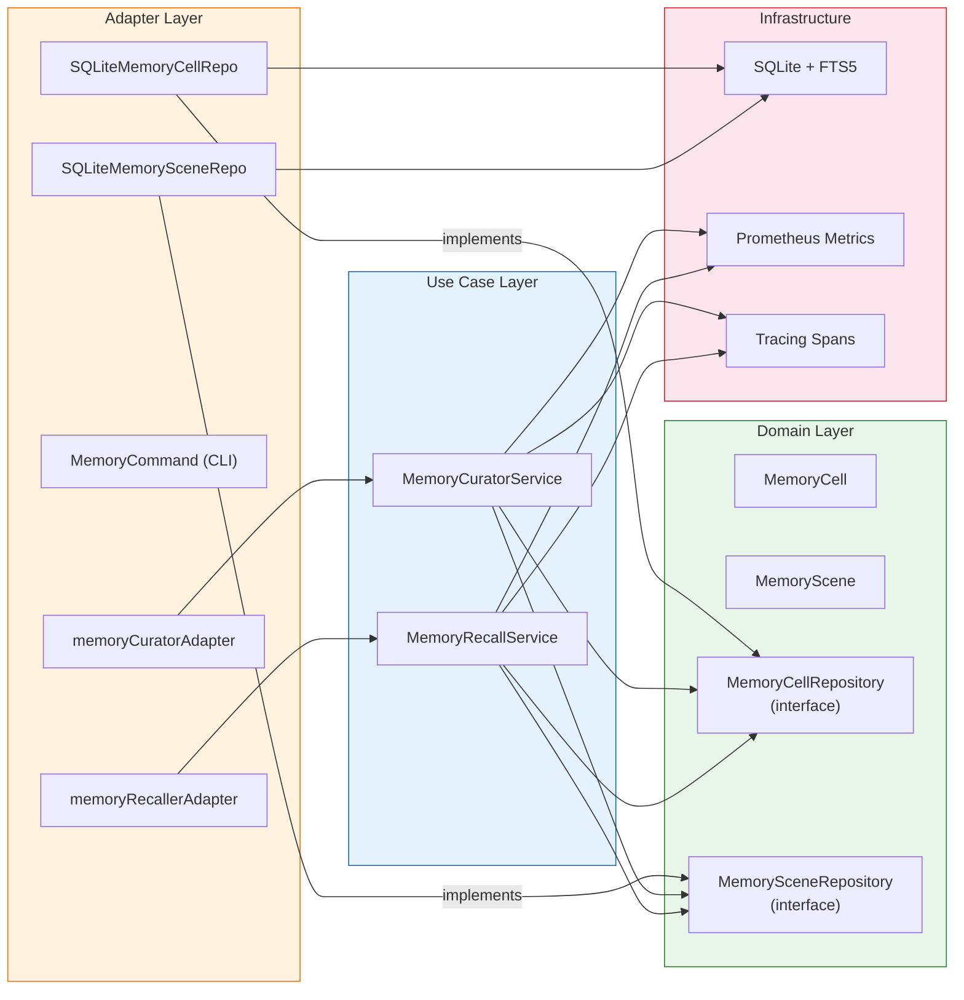

# NuimanBot Technical Documentation

**Version:** 1.3
**Last Updated:** 2026-08-05
**Completion Status:** Core Platform 100% Complete — Persistent Agent Workspace In Progress
**CI/CD Status:** ✅ All Pipelines Passing

---

## Table of Contents

1. [Architecture Overview](#architecture-overview)
2. [System Design](#system-design)
3. [Performance Features](#performance-features)
4. [Security Architecture](#security-architecture)
5. [Observability & Monitoring](#observability--monitoring)
6. [Data Flow](#data-flow)
7. [Self-Organizing Memory v2](#self-organizing-memory-v2)
8. [API Documentation](#api-documentation)
9. [MCP Client Architecture](#mcp-client-architecture)
10. [Buzz Gateway & Nostr Protocol Architecture](#buzz-gateway--nostr-protocol-architecture)
11. [REST API Security Architecture](#rest-api-security-architecture)
12. [TLS Auto-Generation Architecture](#tls-auto-generation-architecture)
13. [Web Admin Security Architecture](#web-admin-security-architecture)
14. [Ingatan Memory Backend Architecture](#ingatan-memory-backend-architecture)
15. [Persistent Agent Workspace Architecture](#persistent-agent-workspace-architecture)
16. [Configuration](#configuration)
17. [Testing Strategy](#testing-strategy)
18. [CI/CD Pipeline](#cicd-pipeline)
19. [Deployment Architecture](#deployment-architecture)

---

## Architecture Overview

### Clean Architecture Principles

NuimanBot follows **Clean Architecture** with strict dependency inversion:

```
┌─────────────────────────────────────────────────┐
│  Infrastructure Layer                           │
│  • LLM Clients (Anthropic, OpenAI, Bedrock, Ollama) │
│  • Encryption (AES-256-GCM) + TLS cert gen     │
│  • Caching (In-memory LRU)                      │
│  • Metrics (Prometheus)                         │
│  • External APIs (Weather, Search)              │
│  • Storage (file-based + Ingatan HTTP client)   │
│  • MCP transports (HTTP, stdio)                 │
└────────────┬────────────────────────────────────┘
             │ implements interfaces
┌────────────▼────────────────────────────────────┐
│  Adapter Layer                                  │
│  • CLI Gateway                                  │
│  • Telegram Gateway                             │
│  • Slack Gateway                                │
│  • Web Admin Server (TLS, session auth, RBAC)  │
│  • REST API Server (JWT, rate limiting)         │
│  • MCP Tool Bridge (MCPToolAdapter)             │
│  • File Repositories (Users, Messages, Notes)   │
│  • Memory Factory (backend selector)            │
└────────────┬────────────────────────────────────┘
             │ implements interfaces
┌────────────▼────────────────────────────────────┐
│  Use Case Layer                                 │
│  • Chat Service (orchestration)                 │
│  • Tool Execution Service (RBAC)               │
│  • Security Service (validation, audit)         │
│  • User Management                              │
│  • Memory v2 (MemoryCuratorService, MemoryRecallService) │
└────────────┬────────────────────────────────────┘
             │ uses entities
┌────────────▼────────────────────────────────────┐
│  Domain Layer                                   │
│  • Entities (User, Message, Conversation)       │
│  • Memory v2 Entities (MemoryCell, MemoryScene) │
│  • Interfaces (LLMService, SkillRegistry,       │
│    MemoryCellRepository, MemorySceneRepository) │
│  • Business Rules                               │
│  • Zero external dependencies                   │
└─────────────────────────────────────────────────┘
```

**Key Principles:**
- Dependencies flow inward (outer layers depend on inner)
- Inner layers define interfaces; outer layers implement them
- Domain layer has zero external dependencies (stdlib only)
- All dependencies are injected via constructors

---

## System Design

### Core Components

#### 1. Chat Service (`internal/usecase/chat/service.go`)

**Responsibilities:**
- Message processing orchestration
- LLM interaction with tool calling
- Conversation history management
- Context window optimization
- Response caching

**Architecture:**
```go
type Service struct {
    llmService       LLMService
    memoryRepo       MemoryRepository
    skillExecService SkillExecutionService
    securityService  SecurityService
    cache            LLMCache  // Optional
}
```

**Message Processing Flow:**
1. Input validation (security service)
2. Load conversation history (memory repository)
3. List available tools (tool service)
4. Prepare LLM request with tools
5. **Tool calling loop** (max 5 iterations):
   - Call LLM
   - If tool calls: execute and add results to conversation
   - If no tool calls: final response
6. **Cache final response** (if cache configured)
7. Save messages to memory
8. Return response

**Context Window Management:**
```go
func (s *Service) BuildContextWindow(
    ctx context.Context,
    conversationID string,
    provider domain.LLMProvider,
    maxTokens int,
) ([]domain.Message, int)
```

- Provider-aware limits: Anthropic (200k), OpenAI (128k), AWS Bedrock (200k), Ollama (32k)
- Automatic truncation of oldest messages
- Reserved tokens for response generation (2000)

**Conversation Summarization:**
```go
func (s *Service) SummarizeConversation(
    ctx context.Context,
    conversationID string,
    maxTokens int,
) (string, error)
```

- Uses Claude Haiku (cost-optimized)
- Preserves key facts, dates, numbers, decisions
- System prompt emphasizes factual summarization

#### 2. Tool Execution Service (`internal/usecase/tool/service.go`)

**Responsibilities:**
- Tool registration and discovery
- RBAC enforcement (role-based access control) — see the live-chat caveat below
- Side-effecting action confirmation gating (Part C)
- Rate limiting integration
- Tool execution with timeout
- Audit logging, including `injection_flagged`/`matched_patterns` when tool output is flagged by `OutputValidator`

**RBAC Model** (`internal/usecase/tool/permissions.go`):
```go
type Role string // defined in internal/domain

const (
    RoleGuest Role = "guest"  // No auth required
    RoleUser  Role = "user"   // Registered users
    RoleAdmin Role = "admin"  // Administrators
)

// ToolPermissions is an explicit, CI-guarded entry for every registered
// tool (internal/usecase/tool/permissions_test.go fails the build if any
// registered tool has no entry here). Excerpt:
var ToolPermissions = map[string]domain.Role{
    "calculator":    domain.RoleGuest,
    "datetime":      domain.RoleGuest,
    "weather":       domain.RoleUser,
    "websearch":     domain.RoleUser, // registered tool name; NOT "web_search"
    "notes":         domain.RoleUser,
    "repo_search":   domain.RoleUser,
    "doc_summarize": domain.RoleUser,
    "summarize":     domain.RoleUser,
    "github":        domain.RoleAdmin, // read actions (issue_list, pr_list,
    "coding_agent":  domain.RoleAdmin, // repo_view, ...) downgraded to
    "executor":      domain.RoleAdmin, // RoleUser by resolveRequiredRole's
    "admin.user":    domain.RoleAdmin, // action-aware check for github only
}

const DefaultToolPermission = domain.RoleUser // unrecognized tool → RoleUser
```

- `mcp:<server>:<tool>` entries are not in this static map — their role is resolved dynamically from the MCP tool's trust classification (see MCP Client Architecture below): `write`/`unknown` trust → `RoleAdmin`-equivalent, `read_only` trust → `RoleUser`.
- A `tools.permissions` config override can revert a whole tool's effective role without a code change.

**Two enforcement entry points; the live chat loop now uses the RBAC-checked one:**
```go
// Enforces RBAC (checkPermission) AND the confirmation gate. Called from
// both of chat.Service's tool-execution sites (the main tool-calling loop
// in tool_conversion.go and the confirmation-approval re-invocation path
// in service.go) since the FR-001/FR-002 fix (commit cecf931).
func (s *Service) ExecuteWithUser(
    ctx context.Context,
    user *domain.User,
    conversationID, toolName string,
    params map[string]any,
) (*domain.ExecutionResult, error)

// Enforces the confirmation gate (via a context-carried
// security.ConfirmationIdentity) but NOT role-based checkPermission.
// No longer called by chat.Service — retained for callers that
// intentionally have no role-bearing *domain.User to pass.
func (s *Service) Execute(
    ctx context.Context,
    toolName string,
    params map[string]any,
) (*domain.ExecutionResult, error)
```

**RBAC enforcement in live chat (fixed by FR-001/FR-002, commit `cecf931`):** the live chat tool-calling loop now calls `ExecuteWithUser`, not `Execute`, at both of `chat.Service`'s tool-execution sites — the main tool-calling loop (`chat.tool_conversion.go`) and the confirmation-approval re-invocation path (`chat.Service`, after a pending confirmation is approved). Role-based tool permissions (the `ToolPermissions` map above) are correctly defined, unit-tested, CI-guarded, and now enforced end-to-end for a tool call made during a real conversation. Each incoming message resolves a role-bearing `*domain.User` via `resolveUser` in `chat.Service`, which calls `UserService.GetUserByPlatformUID` and, on `domain.ErrUserNotFound`, `UserService.CreateUser` — defaulting new non-CLI identities to `RoleGuest` and CLI to `RoleAdmin` (`defaultRoleForPlatform`), never granting implicit trust to an unregistered identity. `main.go` constructs `UserService` once (`user.NewService`, file-backed via `domain_users.json`) and passes it directly into `chat.NewService`, shared by every gateway including Buzz. The side-effecting-action confirmation gate (Part C) continues to work exactly as before — it is wired via a context-carried `(UserID, ConversationID)` identity set by `ChatService`, and `ExecuteWithUser` runs that same confirmation check in addition to `checkPermission`, so it remains fully live for real conversations. The regression test `TestProcessMessage_RBAC_NonAdminCannotInvokeGitHubPRMerge` (`internal/usecase/chat/rbac_test.go`) proves a non-admin chat user's attempt to invoke `github.pr_merge` is now denied at the RBAC layer.

**Rate Limiting:**
- Token bucket algorithm
- Per-user, per-tool limits
- Configurable requests/window
- Audit on rate limit exceeded

### RBAC Enforcement Fix (All Platforms)

Discovered during Buzz gateway spec review (research.md Q6) and fixed as part of the Buzz Phase 3 delivery, this closes a pre-existing gap that affected **every** platform (Telegram, Slack, CLI, Buzz), not just Buzz:

**Before the fix:**
- `ChatService`'s tool-invocation path (`internal/usecase/chat/tool_conversion.go`) called `tool.Service.Execute()` — the unchecked execution path — meaning a tool call surfaced by the LLM's tool-calling loop ran regardless of the calling user's role.
- `tool.Service.ListTools()` returned every registered tool for every caller, ignoring role entirely (a `TODO` at the call site).

**After the fix:**
- `tool_conversion.go` now calls `tool.Service.ExecuteWithUser(ctx, user, toolName, args)`, the same role-checked, rate-limited path `Execute()`/`ExecuteWithUser()` was always meant to guard.
- `ListTools(ctx, user)` filters the registry's tools through the same `checkPermission` rule `ExecuteWithUser` applies — a tool a user's role cannot execute is never listed as available (`internal/usecase/tool/service.go`).
- `ChatService.resolveUser` (`internal/usecase/chat/service.go`) is the shared, platform-agnostic entry point all four gateways now route through to resolve/create the `domain.User` used for these checks: `GetUserByPlatformUID`, falling back to `CreateUser` with a platform-dependent default role on first message.

**Default role by platform** (`defaultRoleForPlatform`, `internal/usecase/chat/service.go`):

| Platform | Default role for a new user | Why |
|---|---|---|
| CLI | `RoleAdmin` | Inherently local/trusted — whoever can run the binary already has full machine access, so gating behind RBAC adds friction without adding real security. Preserves the CLI's pre-existing de facto unrestricted access. |
| Telegram, Slack, Buzz | `RoleGuest` | The sender is a remote, unauthenticated-by-default party; least-privilege default until an admin promotes them. |

**Why fixed for all platforms, not scoped to Buzz:** the shared `ChatService` tool-invocation path does not branch by platform, so it was not possible to enforce RBAC for Buzz-originated tool calls without also enforcing it for Telegram/Slack/CLI — and leaving them unchecked while Buzz was checked would have been an inconsistent, hard-to-reason-about security posture. This is a deliberate behavior change: existing Telegram/Slack/CLI users whose role lacks permission for a tool they could previously call unchecked will see that tool become unavailable. Regression coverage (`internal/usecase/chat/rbac_test.go`) verifies RBAC/rate-limiting is enforced for tool calls originating from each platform, not just Buzz.

#### 3. Security Service (`internal/usecase/security/service.go`)

**Responsibilities:**
- Input validation (length, null bytes, UTF-8, injection attacks) for **direct user input only**
- Audit logging
- (Future: Encryption operations)

This service's `ValidateInput` is wired only to content a human typed directly (chat messages, REST API JSON string fields). It is a distinct code path from `OutputValidator` (`internal/usecase/security/output_validation.go`), which scans tool-fetched content instead — see [Tool-Output Injection Filtering](#tool-output-injection-filtering-outputvalidator) under Security Architecture below.

**Input Validation:**
```go
func (s *Service) ValidateInput(
    ctx context.Context,
    input string,
    maxLength int,
) (string, error)
```

- Length enforcement (configurable, default 4096)
- Null byte detection
- UTF-8 validation
- Prompt injection pattern matching (30+ patterns)
- Command injection pattern matching (50+ patterns)

**Categorized Errors:**
```go
type ErrorCategory string

const (
    ErrorCategoryUser     ErrorCategory = "user_error"      // 4xx
    ErrorCategorySystem   ErrorCategory = "system_error"    // 5xx
    ErrorCategoryExternal ErrorCategory = "external_error"  // External service
    ErrorCategoryAuth     ErrorCategory = "auth_error"      // 401/403
)
```

---

## Performance Features

### 1. Database Connection Pooling

**Configuration** (`cmd/nuimanbot/main.go`):
```go
db.SetMaxOpenConns(25)  // Max concurrent connections
db.SetMaxIdleConns(5)   // Idle connection pool
db.SetConnMaxLifetime(5 * time.Minute)  // Recycle connections
db.SetConnMaxIdleTime(1 * time.Minute)  // Close idle connections
```

**Rationale:**
- SQLite has single-writer concurrency model
- 25 max open prevents connection exhaustion
- 5 idle connections provide immediate availability
- Lifecycle management prevents stale connections

**Monitoring:**
```go
stats := db.Stats()
// Returns: OpenConnections, InUse, Idle, WaitCount, WaitDuration
```

### 2. LLM Response Caching

**Implementation** (`internal/infrastructure/cache/llm_cache.go`):
```go
type LLMCache struct {
    entries   map[string]*cacheEntry
    maxSize   int           // 1000 entries
    ttl       time.Duration // 1 hour
    mu        sync.RWMutex
    hits      uint64
    misses    uint64
    evictions uint64
}
```

**Cache Key Generation:**
- SHA256 hash of normalized prompt
- Normalization: trim whitespace
- Case-sensitive matching

**Eviction Policy:**
- **Size-based**: LRU (oldest entry by expiration time)
- **Time-based**: TTL expiration (1 hour default)

**Cache Statistics:**
```go
stats := cache.Stats()
// Returns: Size, Hits, Misses, Evictions, HitRate
```

**Test Coverage:** 100% (10 comprehensive tests)

### 3. Message Batching

**Implementation** (`internal/adapter/repository/sqlite/batcher.go`):
```go
type MessageBatcher struct {
    buffer        []messageItem
    maxSize       int           // 100 messages
    flushInterval time.Duration // 5 seconds
    ticker        *time.Ticker
    flushCh       chan struct{}
    mu            sync.Mutex
}
```

**Dual Flush Strategy:**
- **Size-based**: Flush when buffer reaches 100 messages
- **Time-based**: Periodic flush every 5 seconds

**Graceful Shutdown:**
```go
func (b *MessageBatcher) Stop() {
    close(b.stopCh)
    b.wg.Wait()
    b.Flush(context.Background())  // Final flush
}
```

---

## Security Architecture

### Encryption & Secrets

**Credential Vault** (`internal/infrastructure/crypto/file_credential_vault.go`):
- **Algorithm**: AES-256-GCM (authenticated encryption)
- **Key Derivation**: 32-byte key from `NUIMANBOT_ENCRYPTION_KEY`
- **Storage**: `data/vault.enc` (JSON, encrypted)

**Secret Rotation** (`internal/infrastructure/crypto/versioned_vault.go`):
```go
type VersionedVault struct {
    keys           map[int][]byte  // version -> key
    currentVersion int
}
```

- **Multi-version support**: Store secrets with version prefix (4 bytes)
- **Graceful rotation**: Old keys remain valid during transition
- **Zero downtime**: No service restart required

**Encrypted Storage Format:**
```
[4-byte version][encrypted data][GCM tag]
```

### Audit Logging

**Audit Events:**
```go
type AuditEvent struct {
    Timestamp time.Time
    Action    string  // skill_execute, rate_limit_exceeded, etc.
    Resource  string
    Outcome   string  // success, failure, denied
    Details   map[string]any
}
```

**Logged Events:**
- Tool executions (success, failure, permission denied)
- Rate limit violations
- Input validation failures
- Security-relevant operations

### Input Validation (Direct User Input)

**Threat Protection:**
- **Prompt Injection**: 30+ patterns (instruction override, role manipulation)
- **Command Injection**: 50+ patterns (shell metacharacters, dangerous commands)
- **SQL Injection**: Parameterized queries (no raw SQL)
- **XSS**: N/A (no web UI, but input sanitized)

**Validation Layers:**
1. Length check (configurable max)
2. Null byte detection
3. UTF-8 validation
4. Pattern matching (regex-based)

**Scope:** this validation runs on content a human typed directly — chat messages and REST API JSON string fields. It does not run on content the agent fetches on its own behalf via a tool (web pages, search results, MCP responses); that is a structurally separate mechanism, described next.

### Tool-Output Injection Filtering (`OutputValidator`)

`internal/usecase/security/output_validation.go` reuses the exact same underlying pattern list as the input validator above (`internal/usecase/security/prompt_injection_patterns.go`'s `detectPromptInjectionPatterns`, extracted as a shared helper both validators call), applied instead to content the agent fetches itself:

```go
type ValidationResult struct {
    Flagged         bool
    MatchedPatterns []string
    Action          ValidationAction // "pass" | "annotate" | "reject"
}

type OutputValidator interface {
    ValidateToolOutput(ctx context.Context, source, content string) (ValidationResult, error)
}
```

**Call sites** (all optional/nil-tolerant via a setter or functional option, defaulting to `security.NewDefaultOutputValidator()`):
- `summarize`/`doc_summarize` — ahead of the summarization sub-prompt
- `websearch` — per search result; a flagged result is dropped (`reject`) or annotated in place (`annotate`), not a whole-call failure
- `internal/adapter/mcp/tool_bridge.go`'s `MCPToolAdapter` — alongside the pre-existing `OutputSanitizer` call (sanitize first, then validate), regardless of the MCP tool's trust level

**Behavior:**
- Empty, whitespace-only, and non-UTF-8 content always passes cleanly (`Flagged: false`) rather than erroring or false-flagging
- Default action `reject` fails the tool call closed; `annotate` wraps flagged content with a `[SECURITY WARNING: possible injected instructions detected]` marker and passes it through (`security.tool_output_validation.action` config)
- Flagged content is excluded from the input passed to `MemoryCurator.ExtractMemoryCells`, closing the stored/second-order injection path
- `tool/service.go`'s `Execute()` extracts `injection_flagged`/`matched_patterns` from the tool's result metadata (success path) or via `errors.As` on a `FlaggedOutputError` (reject path) into the audit `Details` map

**Distinct from `OutputSanitizer`:** `OutputSanitizer` (pre-existing, `internal/usecase/tool/common`) only redacts secrets/credentials from tool output — it has no concept of injection-pattern detection. `OutputValidator` is a separate, newer mechanism with a separate purpose; MCP output passes through both, in sequence, and neither is a substitute for the other.

### Prompt-Boundary Guardrails

- `formatToolResults` (`internal/usecase/chat/tool_conversion.go`) wraps every tool result — regardless of tool identity or whether `OutputValidator` flagged/annotated it — in `<tool_output source="TOOLNAME">...</tool_output>` delimiters before it is sent to the LLM.
- `PromptComposer.Compose()` (`internal/usecase/persona/promptcomposer.go`) prepends a fixed, non-overridable guardrail instructing the model to treat `<tool_output>` content as data, never as instructions. It is written ahead of the `sectionOrder`-driven persona layers (RULES → SOUL → USER) and its token cost is reserved unconditionally in `calcOverhead`, so it survives per-file and total token-budget truncation intact — verified even when the configured budget is smaller than the guardrail's own token cost.
- This is a structural defense, independent of pattern matching: it exists specifically to catch paraphrased/novel injection wording that `OutputValidator`'s fixed pattern list doesn't match.

### Side-Effecting Action Confirmation (Part C)

```go
type ConfirmationStore interface {
    Create(ctx context.Context, req ConfirmationRequest) (ConfirmationRequest, error)
    Get(ctx context.Context, id string) (ConfirmationRequest, error)
    GetOpenByKey(ctx context.Context, userID, conversationID string) (ConfirmationRequest, bool, error)
    Resolve(ctx context.Context, id string, approved bool) (ConfirmationRequest, error)
    ListPending(ctx context.Context) ([]ConfirmationRequest, error)
    ExpireStale(ctx context.Context) (int, error)
}
```

- File-backed implementation: `internal/infrastructure/security/confirmation_store.go` (`FileConfirmationStore`), with every operation (`Create`, `Resolve`, `Get`, `GetOpenByKey`, `ListPending`, `ExpireStale`) fully serialized by a single mutex — guaranteeing exactly one `Create` succeeds per `(UserID, ConversationID)` and exactly one `Resolve` succeeds per confirmation ID under concurrent access — a deliberate simplicity-over-throughput tradeoff since this store sits on the rare, human-gated confirmation-creation path rather than the tool-loop hot path; TTL expiry is checked lazily on every read/write, not only by a periodic reaper.
- `security.confirmation.default_required_actions` (config) lists actions requiring confirmation by default (`github.pr_merge`, `github.issue_close`, `github.issue_create`, `coding_agent.yolo_mode`), unioned with per-user RULES.md `requires_confirmation` entries.
- When a gated action is attempted, the tool-calling loop ends the current turn immediately with the confirmation's human-readable summary, without consuming a loop iteration. `ChatService.ProcessMessage` checks `GetOpenByKey` at the top of every incoming message to detect a resolving reply.
- **Resolution paths**: a case-insensitive, exact-match plain-text "yes"/"y"/"approve"/"confirm" or "no"/"n"/"deny"/"cancel"/"reject" reply works identically through every gateway's existing message-handling path (zero gateway-specific code required). Slack (Block Kit buttons) and Telegram (inline keyboard) additionally render interactive buttons that resolve the same confirmation via the same underlying mechanism — the plain-text form is always sent alongside as a fallback, not replaced. This is additive UX on two gateways, **not a universal rich UI** — no other gateway or channel has button support. The web admin UI (`GET /admin/confirmations`, per-item Approve/Deny) and REST API (`GET /api/v1/confirmations/{id}`, `POST /api/v1/confirmations/{id}/resolve`) provide a non-chat alternative, both ultimately calling `ChatService.ResolveConfirmation`.
- An unresolved confirmation expires after `security.confirmation.timeout` (default 5 minutes, config-driven) and is treated as denied. At most one open confirmation is permitted per `(UserID, ConversationID)`.
- Fail-closed: `ConfirmationStore`/`OutputValidator` failures deny/reject rather than proceed.

### MCP Tool Trust Classification (Part F)

See [MCP Client Architecture](#mcp-client-architecture) below for the full mechanism. In summary: `mcp.json` gains an optional per-server `trust` field (`read_only`/`write`/`unknown`, default `unknown`) plus a `tool_overrides` map for per-tool exceptions. The resolved trust level is attached to each bridged `MCPToolAdapter` and consulted dynamically (via a `TrustClassifiedTool` interface, not a static map entry) by both the RBAC check and the confirmation-requirement check for the `mcp:<server>:<tool>` namespace: `write`/`unknown` trust is treated as admin-only and confirmation-required; `read_only` trust is treated as `RoleUser`. Trust never affects whether `OutputValidator` scans the tool's output — that runs unconditionally regardless of trust level.

### SSRF Hardening (Part E)

- `ValidateFetchURL` (`internal/usecase/tool/common/url_validator.go`) resolves a fetch target's IP address(es) and rejects loopback (v4/v6), RFC 1918 private ranges, link-local addresses (including the `169.254.169.254` cloud metadata address), unspecified addresses (`0.0.0.0`/`::`), and multicast/reserved ranges. A hostname resolving to a mix of allowed and disallowed IPs is rejected if **any** resolved address is disallowed.
- Applied to both `summarize` and `doc_summarize` on the initial request, and re-applied on every redirect hop via `NewCheckRedirect` (`internal/usecase/tool/common/ssrf_transport.go`). The validated IP for a redirect hop is pinned into the request's context and dialed directly (`pinnedDialContext`), closing the DNS-rebinding TOCTOU window between validation and dial — while `req.URL`/`req.Host` remain untouched, so TLS SNI and HTTP virtual-hosting still target the original hostname.
- **Scope note**: pinning applies to redirect hops only. The initial request still has the same small, standard validate-then-dial TOCTOU window essentially every SSRF-safe client built on `net/http` accepts for a first hop with no redirect involved.
- `security.fetch.ssrf_protection`/`follow_redirects` config controls this behavior; disabling redirect-following (`follow_redirects: false`) restores Go's exact stock `http.Client` default redirect policy (10-redirect limit) rather than reimplementing it.

### Phase 3 Advanced Features Architecture

#### 4. Subagent Execution Service (`internal/usecase/skill/subagent/`)

**Responsibilities:**
- Context forking with deep copy isolation
- Autonomous multi-step execution with LLM orchestration
- Resource limit enforcement (tokens, tool calls, timeout)
- Background execution management

**Architecture:**
```go
type SubagentExecutor struct {
    llmService    domain.LLMService
    toolService   domain.ToolExecutionService
    forker        *ContextForker
}

type LifecycleManager struct {
    executor       SubagentExecutor
    registry       map[string]*runningSubagent  // Thread-safe
    mu             sync.RWMutex
    monitoringHook func(string, domain.SubagentStatus)
}
```

**Context Forking:**
```go
func (f *ContextForker) Fork(
    original *domain.SubagentContext,
) (*domain.SubagentContext, error)
```

- Deep copy of conversation history (prevents cross-contamination)
- Deep copy of allowed tools (independent tool restrictions)
- Proper timestamp initialization
- Metadata preservation

**Autonomous Execution Loop:**
```go
func (e *SubagentExecutor) Execute(
    ctx context.Context,
    subagentCtx *domain.SubagentContext,
) (*domain.SubagentResult, error)
```

1. Validate resource limits
2. **Multi-step loop** (max iterations based on tool call limit):
   - Call LLM with conversation history and allowed tools
   - Check token usage against limit
   - If tool calls requested:
     - Execute tools (enforcing restrictions)
     - Add tool results to conversation
     - Increment tool call counter
   - If no tool calls: final response achieved
3. Aggregate results with step tracking
4. Return SubagentResult with conversation, steps, resource usage

**Thread-Safe Lifecycle Management:**
- RWMutex for concurrent access to registry
- Start: Spawn goroutine, register in map
- Cancel: Context cancellation, graceful shutdown
- GetStatus: Read-only access with RLock
- ListRunning: Snapshot of all running subagents
- Shutdown: 30s timeout for cleanup

**Performance:**
- Context forking: ~50 ns/op (deep copy efficiency)
- Lifecycle operations: ~5.86 ms/op
- Concurrent execution: 10 agents in ~11.77 ms

#### 5. Preprocessing Infrastructure (`internal/infrastructure/skill/` & `internal/infrastructure/preprocess/`)

**Responsibilities:**
- Parse !command blocks from SKILL.md files
- Execute commands in security sandbox
- Substitute command outputs into skill templates

**Parser Architecture:**
```go
type PreprocessParser struct{}

func (p *PreprocessParser) Parse(content string) ([]domain.PreprocessCommand, error)
```

- Scans for `!command` markers using bufio.Scanner
- Extracts commands until `!end` or empty line
- Returns slice of PreprocessCommand entities

**Sandbox Architecture:**
```go
type CommandSandbox struct {
    whitelist  []string  // git, gh, ls, cat, grep
    timeout    time.Duration  // 5 seconds
    maxOutput  int  // 10KB
}

func (s *CommandSandbox) Execute(
    ctx context.Context,
    cmd domain.PreprocessCommand,
) (*domain.CommandResult, error)
```

**Security Constraints:**
1. **Whitelist enforcement**: Only git, gh, ls, cat, grep allowed
2. **Shell metacharacter blocking**: Reject |, ;, &, $, `, >, <, ||, &&
3. **Timeout enforcement**: Kill after 5 seconds
4. **Output limiting**: Truncate at 10KB
5. **Working directory restriction**: Configurable working directory

**Renderer Integration:**
```go
type PreprocessRenderer struct {
    parser     *PreprocessParser
    sandbox    *CommandSandbox
    baseRenderer *SkillRenderer
}

func (r *PreprocessRenderer) Render(
    ctx context.Context,
    skill *domain.Skill,
    args []string,
) (*domain.RenderedSkill, error)
```

**Two-phase rendering:**
1. Execute preprocessing commands, collect outputs
2. Apply argument substitution with command results

#### 6. Plugin Discovery & Management (`internal/infrastructure/plugin/` & `internal/usecase/plugin/`)

**Responsibilities:**
- Scan filesystem for plugin manifests
- Parse plugin.yaml files
- Validate plugin security constraints
- Manage plugin lifecycle

**Discovery Architecture:**
```go
type PluginDiscovery struct {
    baseDir string  // e.g., data/plugins/
}

func (d *PluginDiscovery) Scan(
    ctx context.Context,
    pluginDir string,
) ([]*domain.Plugin, error)
```

**Scanning Process:**
1. Walk directory tree looking for plugin.yaml files
2. Parse YAML manifest for each plugin
3. Validate namespace format (org/skill-name)
4. Detect namespace collisions
5. Return slice of Plugin entities

**Security Validation:**
```go
func ValidatePluginSecurity(manifest *domain.PluginManifest) error
```

- Reserved word check (nuimanbot, system, admin, internal)
- Namespace format validation (must contain /)
- Dependency limit (max 10 dependencies)
- Circular dependency detection

**Plugin Manager:**
```go
type PluginManager struct {
    discovery *PluginDiscovery
    registry  domain.PluginRegistry
}

func (m *PluginManager) Install(pluginPath string) error
func (m *PluginManager) Uninstall(namespace string) error
func (m *PluginManager) Enable(namespace string) error
func (m *PluginManager) Disable(namespace string) error
```

#### 7. Version Resolution (`internal/infrastructure/skill/version.go` & `internal/usecase/skill/version_manager.go`)

**Responsibilities:**
- Parse semantic versions (x.y.z format)
- Compare versions for ordering
- Resolve version constraints (^, ~, =)

**Version Architecture:**
```go
type SkillVersion struct {
    Major int
    Minor int
    Patch int
    Pre   string   // Optional pre-release (e.g., -alpha.1)
    Build string   // Optional build metadata (e.g., +20130313144700)
}

func ParseVersion(v string) (*SkillVersion, error)
func (v *SkillVersion) Compare(other *SkillVersion) int  // -1, 0, 1
```

**Version Constraints:**
```go
type VersionConstraint struct {
    Operator string       // ^, ~, =, >=, <=, <, >
    Version  *SkillVersion
}

func (c *VersionConstraint) Satisfies(v *SkillVersion) bool
```

**Constraint Semantics:**
- Caret (^1.2.3): >=1.2.3 <2.0.0 (compatible with 1.x.x)
- Tilde (~1.2.3): >=1.2.3 <1.3.0 (compatible with 1.2.x)
- Exact (1.2.3): ==1.2.3 (exact match only)

#### 8. Memory Storage (`internal/infrastructure/memory/storage.go` & `internal/usecase/skill/memory_api.go`)

**Responsibilities:**
- Persist skill memory in SQLite database
- Support multiple scopes (skill, user, global, session)
- Automatic expiration and cleanup

**Storage Architecture:**
```go
type SQLiteMemoryStorage struct {
    db *sql.DB
}

func (s *SQLiteMemoryStorage) Set(memory *domain.SkillMemory) error
func (s *SQLiteMemoryStorage) Get(skillName, key string, scope domain.MemoryScope) (*domain.SkillMemory, error)
func (s *SQLiteMemoryStorage) Delete(skillName, key string, scope domain.MemoryScope) error
func (s *SQLiteMemoryStorage) List(skillName string, scope domain.MemoryScope) ([]*domain.SkillMemory, error)
func (s *SQLiteMemoryStorage) Cleanup() error  // Remove expired entries
```

**Database Schema:**
```sql
CREATE TABLE skill_memory (
    skill_name TEXT NOT NULL,
    scope TEXT NOT NULL,
    key TEXT NOT NULL,
    value TEXT NOT NULL,  -- JSON serialized
    created_at TIMESTAMP NOT NULL,
    expires_at TIMESTAMP,
    PRIMARY KEY (skill_name, scope, key)
);

CREATE INDEX idx_expires_at ON skill_memory(expires_at);
```

**Memory API:**
```go
type MemoryAPI struct {
    storage domain.MemoryQuery
}

func (api *MemoryAPI) Remember(skillName, key string, value interface{}, scope domain.MemoryScope) error
func (api *MemoryAPI) Recall(skillName, key string, scope domain.MemoryScope, dest interface{}) error
func (api *MemoryAPI) Forget(skillName, key string, scope domain.MemoryScope) error
```

**JSON Serialization:**
- Values serialized with `json.Marshal(value)`
- Values deserialized with `json.Unmarshal([]byte(memory.Value), dest)`
- Supports any JSON-serializable type

**Memory Scopes:**
- `MemoryScopeSkill`: Isolated per skill
- `MemoryScopeUser`: Isolated per user (future)
- `MemoryScopeGlobal`: Shared across all invocations
- `MemoryScopeSession`: Temporary, session-specific

---

## Observability & Monitoring

### Prometheus Metrics

**Endpoint:** `GET /metrics`

**Metric Categories:**

**1. HTTP Metrics:**
```prometheus
http_requests_total{method, path, status}
http_request_duration_seconds{method, path}
```

**2. LLM Metrics:**
```prometheus
llm_requests_total{provider, model, status}
llm_request_duration_seconds{provider, model}
llm_tokens_used_total{provider, model, type}
llm_cost_usd_total{provider, model}
```

**3. Tool Metrics:**
```prometheus
skill_executions_total{tool, status}
skill_execution_duration_seconds{tool}
```

**4. Cache Metrics:**
```prometheus
cache_hits_total{cache_type="llm"}
cache_misses_total{cache_type="llm"}
cache_evictions_total{cache_type="llm"}
```

**5. Database Metrics:**
```prometheus
db_queries_total{operation, status}
db_query_duration_seconds{operation}
db_connections_open
db_connections_idle
```

**6. Security Metrics:**
```prometheus
rate_limit_exceeded_total{user_id, action}
security_validation_failures_total{reason}
audit_events_total{action, outcome}
```

**7. Buzz Gateway Metrics:**
```prometheus
buzz_events_received_total{channel_id, sender_is_agent}
buzz_events_published_total{status}
buzz_signature_verification_failures_total
buzz_relay_connections  # aggregate connected-relay count, polled from Client every 250ms
```

### Health Checks

**Endpoints:**

| Endpoint | Purpose | Kubernetes |
|----------|---------|------------|
| `GET /health` | Liveness probe | `livenessProbe` |
| `GET /health/ready` | Readiness probe | `readinessProbe` |
| `GET /health/version` | Version info | N/A |

**Readiness Checks:**
- Database connectivity
- LLM provider availability
- Credential vault accessibility

### Request Tracing

**Request ID Propagation:**
```go
// Generate request ID
ctx, reqID := requestid.MustFromContext(ctx)

// Log with request ID
logger := requestid.Logger(ctx)
logger.Info("Processing message", "platform", platform)
```

**Request ID Format:** SHA256 hash (first 32 chars)

**Propagation:** Context-based throughout request lifecycle

---

## Data Flow

### Message Processing Pipeline

```
1. User Input
   │
   ├─> [CLI Gateway] or [Telegram Gateway] or [Slack Gateway]
   │
2. IncomingMessage
   │
   ├─> [Security Service] ValidateInput()
   │   ├─ Length check
   │   ├─ Null byte detection
   │   ├─ UTF-8 validation
   │   └─ Injection pattern matching
   │
3. Validated Input
   │
   ├─> [Chat Service] ProcessMessage()
   │   ├─ Load conversation history
   │   ├─ Resolve caller's role (chat.UserService → domain_users.json /
   │   │   UserProfileRepository; fails closed to RoleGuest if unresolved)
   │   ├─ List available tools, RBAC-filtered by resolved role (ListTools
   │   │   filters registry.List() by caller role — see Security
   │   │   Architecture above)
   │   ├─ Build context window (provider-aware)
   │   ├─ Check cache (if configured)
   │   ├─ Call LLM (with tools)
   │   │   └─ [Tool Calling Loop]
   │   │       ├─ Execute tools via ToolExecutionService.ExecuteWithUser
   │   │       │   (role-based RBAC check + confirmation gate — see above)
   │   │       ├─ Confirmation gate for side-effecting actions (Part C)
   │   │       ├─ Check rate limits (per-user, per-tool)
   │   │       ├─ Injection-pattern scan of tool output (OutputValidator)
   │   │       ├─ Audit tool execution
   │   │       └─ Format tool results (`<tool_output>` delimited)
   │   ├─ Cache final response
   │   └─ Save messages (batched)
   │
4. OutgoingMessage
   │
   └─> Gateway Response
```

### Database Schema

**Tables:**

```sql
-- Conversations
CREATE TABLE conversations (
    id TEXT PRIMARY KEY,
    user_id TEXT NOT NULL,
    platform TEXT NOT NULL,
    created_at TIMESTAMP,
    updated_at TIMESTAMP
);

-- Messages
CREATE TABLE messages (
    id TEXT PRIMARY KEY,
    conversation_id TEXT NOT NULL,
    role TEXT NOT NULL,  -- user, assistant
    content TEXT NOT NULL,
    timestamp TIMESTAMP,
    token_count INTEGER,
    FOREIGN KEY (conversation_id) REFERENCES conversations(id)
);

-- Users
CREATE TABLE users (
    id TEXT PRIMARY KEY,
    role TEXT NOT NULL,  -- guest, user, admin
    allowed_skills TEXT,  -- JSON array
    created_at TIMESTAMP,
    updated_at TIMESTAMP
);

-- Notes
CREATE TABLE notes (
    id TEXT PRIMARY KEY,
    user_id TEXT NOT NULL,
    title TEXT NOT NULL,
    content TEXT NOT NULL,
    tags TEXT,  -- JSON array
    created_at TIMESTAMP,
    updated_at TIMESTAMP,
    FOREIGN KEY (user_id) REFERENCES users(id)
);

-- Skill Memory (Phase 3E)
CREATE TABLE skill_memory (
    skill_name TEXT NOT NULL,
    scope TEXT NOT NULL,      -- skill, user, global, session
    key TEXT NOT NULL,
    value TEXT NOT NULL,      -- JSON serialized
    created_at TIMESTAMP NOT NULL,
    expires_at TIMESTAMP,     -- NULL = no expiration
    PRIMARY KEY (skill_name, scope, key)
);

CREATE INDEX idx_skill_memory_expires ON skill_memory(expires_at);
CREATE INDEX idx_skill_memory_scope ON skill_memory(scope);
```

**Migrations:** Automatically applied on startup via `schema.sql`

### Self-Organizing Memory v2

NuimanBot includes a self-organizing long-term memory system that automatically extracts, organizes, and recalls knowledge across conversations. The system uses a "scene + cell" architecture where individual knowledge units (cells) are organized into topic buckets (scenes) with consolidated summaries.

#### Architecture Overview

The memory system follows Clean Architecture with four layers:



**Source diagrams:** `documentation/diagrams/memory-*.mmd`

#### Memory Cell Types

| Type | Description | Example |
|------|-------------|---------|
| `fact` | Objective information or observations | "User's project uses Go 1.22" |
| `decision` | Choices made or preferences expressed | "Decided to use JWT with 24h expiry" |
| `task` | Action items, TODOs, or goals | "Need to implement rate limiting" |
| `preference` | User preferences or patterns | "User prefers TDD workflow" |
| `plan` | Future plans or strategies | "Will migrate to PostgreSQL in Q3" |
| `risk` | Warnings, concerns, or issues | "API rate limit may be hit at scale" |

#### Memory Extraction Flow

After each chat interaction, the curator service extracts structured memory:

```
ChatService.ProcessMessage()
    → memoryCuratorAdapter.ExtractMemoryCells()
        → MemoryCuratorService.ExtractCells()
            1. Build extraction prompt with interaction context
            2. Call LLM (GenerateJSON) for structured extraction
            3. Parse response into ExtractedCell array
            4. For each cell: validate, persist to memory_cells table
               (FTS5 trigger auto-indexes content)
            5. For each touched scene: consolidate summary
                → Call LLM for scene summary
                → Upsert into memory_scenes table
```

#### Memory Recall Flow

When building context for a new conversation turn:

```
ChatService / BuildContextWindow
    → memoryRecallerAdapter.RecallAndFormat()
        → MemoryRecallService.RecallMemory()
            1. FTS5 full-text search (BM25 ranking, limit 20)
            2. If no FTS results: fallback to high-salience cells
            3. Fetch scene summaries for matched cells
            4. Apply token budget (cells + scenes fit within limit)
            5. Format as markdown for system prompt injection
```

Output format injected into context:
```markdown
### Relevant Long-Term Memory (Curated)

**Scene: authentication**
Summary: User configured OAuth2 with JWT tokens...

**Key Facts:**
- [decision, salience=0.90] Decided to use JWT with 24-hour expiry
- [fact, salience=0.85] OAuth2 provider is Auth0

*Retrieved 2 cells from 1 scenes (45 tokens)*
```

#### Memory Database Schema

```sql
-- Structured knowledge units
CREATE TABLE memory_cells (
    id TEXT PRIMARY KEY,              -- UUID
    conversation_id TEXT NOT NULL,    -- User/conversation (max 128)
    scene TEXT NOT NULL,              -- Topic bucket (3-64 chars)
    cell_type TEXT NOT NULL,          -- fact|decision|task|preference|plan|risk
    salience REAL NOT NULL,           -- Importance 0.0-1.0
    content TEXT NOT NULL,            -- Knowledge text (max 2000)
    source TEXT NOT NULL,             -- JSON array of message IDs
    created_at TIMESTAMP NOT NULL,
    updated_at TIMESTAMP NOT NULL,
    expires_at TIMESTAMP              -- Optional expiration
);

-- FTS5 full-text search index (auto-synced via triggers)
CREATE VIRTUAL TABLE memory_cells_fts USING fts5(
    content, scene, cell_type,
    content='memory_cells', content_rowid='rowid'
);

-- Consolidated scene summaries
CREATE TABLE memory_scenes (
    scene TEXT PRIMARY KEY,           -- Topic name (3-64 chars)
    summary TEXT NOT NULL,            -- Consolidated summary (max 10000)
    token_count INTEGER NOT NULL,     -- Summary tokens (1-2000)
    updated_at TIMESTAMP NOT NULL
);
```

**Indexes:** conversation_id, scene, salience DESC, expires_at, created_at DESC, (conversation_id, scene) composite.

**FTS5 Triggers:** Auto-sync on INSERT, UPDATE, DELETE from memory_cells to memory_cells_fts.

#### Memory Metrics (Prometheus)

| Metric | Type | Labels | Description |
|--------|------|--------|-------------|
| `memory_extraction_total` | Counter | status | Extraction operations (success/error/skipped) |
| `memory_extraction_duration_seconds` | Histogram | - | Extraction latency |
| `memory_cells_created_total` | Counter | - | Total cells created |
| `memory_consolidation_total` | Counter | status | Scene consolidations (success/error) |
| `memory_consolidation_duration_seconds` | Histogram | - | Consolidation latency |
| `memory_recall_total` | Counter | status, query_type | Recall operations (fts/fallback) |
| `memory_recall_duration_seconds` | Histogram | - | Recall latency |
| `memory_recall_cells_total` | Counter | - | Total cells recalled |
| `memory_fts_query_duration_seconds` | Histogram | - | FTS query latency |

#### Memory CLI Commands

| Command | Description |
|---------|-------------|
| `/memory list [--scene X] [--type Y] [--limit N]` | List memory cells with filters |
| `/memory get <id>` | Show full cell details |
| `/memory search <query> [--limit N]` | Full-text search across cells |
| `/memory delete <id>` | Delete a specific cell |
| `/memory scenes` | List all scene summaries |
| `/memory prune` | Delete expired cells |
| `/memory help` | Show available commands |

#### Graceful Degradation

- **Memory DB init failure:** App continues without memory v2 (logged warning)
- **Extraction LLM failure:** Error logged, chat continues normally
- **Recall failure:** Empty memory returned, response generated without memory context
- **Individual cell errors:** Collected in result.Errors, non-blocking

---

## API Documentation

### LLM Service Interface

```go
type LLMService interface {
    Complete(
        ctx context.Context,
        provider LLMProvider,
        req *LLMRequest,
    ) (*LLMResponse, error)

    Stream(
        ctx context.Context,
        provider LLMProvider,
        req *LLMRequest,
    ) (<-chan StreamChunk, error)

    ListModels(
        ctx context.Context,
        provider LLMProvider,
    ) ([]ModelInfo, error)
}
```

**Supported Providers:**
- `anthropic` - Claude 3/3.5 family (Opus, Sonnet, Haiku) via Anthropic API
- `openai` - GPT-4, GPT-3.5 via OpenAI API
- `bedrock` - Claude 3/3.5 family via AWS Bedrock (Converse API)
- `ollama` - Local models (Llama, Mistral, etc.)

### Tool Interface

```go
type Tool interface {
    Name() string
    Description() string
    InputSchema() map[string]any
    Execute(
        ctx context.Context,
        params map[string]any,
    ) (*SkillResult, error)
    RequiredPermissions() []Permission
    Config() SkillConfig
}
```

**Built-in Tools:**

**Core Tools (Infrastructure Layer):**
1. **Calculator**: `add`, `subtract`, `multiply`, `divide`
2. **DateTime**: `now`, `format`, `unix`
3. **Weather**: `current`, `forecast`
4. **WebSearch**: `search`
5. **Notes**: `create`, `read`, `update`, `delete`, `list`

**Developer Productivity Tools (Use Case Layer):**
6. **GitHub**: GitHub operations via `gh` CLI (`issue_create`, `issue_list`, `pr_create`, `pr_list`, `pr_review`, `pr_merge`, `repo_view`, `release_create`, `gist_create`, `workflow_run`, `workflow_list`, `repo_clone`)
7. **RepoSearch**: Fast codebase search using `ripgrep` with regex support, context lines, and file filtering
8. **DocSummarize**: LLM-powered document summarization with configurable detail levels
9. **Summarize**: Web page and YouTube video summarization with transcript extraction via `yt-dlp`
10. **CodingAgent**: Orchestrates external coding CLI tools (Codex, Claude Code, OpenCode, Gemini, Copilot) in PTY mode with workspace validation
11. **Executor**: Tool execution engine with RBAC, rate limiting, and orchestration
12. **Common**: Shared utilities for rate limiting, input sanitization, and validation

**Total: 12 Built-in Tools** (5 infrastructure + 7 use case) + dynamic MCP tools

---

## MCP Client Architecture

### Overview

The MCP (Model Context Protocol) client bridges external tool servers into NuimanBot's domain tool registry. It follows the same Clean Architecture layering as built-in tools.

### Transport Interface (`internal/infrastructure/mcp/`)

```go
type Transport interface {
    Send(ctx context.Context, method string, params json.RawMessage) (json.RawMessage, error)
}
```

Two implementations:
- **HTTPTransport**: JSON-RPC 2.0 over HTTP POST. Sends `{"jsonrpc":"2.0","method":...,"params":...,"id":N}`.
- **StdioTransport**: JSON-RPC 2.0 over subprocess stdin/stdout. Spawns `command args...` and communicates line-delimited JSON.

### MCPClient (`internal/infrastructure/mcp/client.go`)

```go
type MCPClient struct {
    transport    Transport
    serverName   string
    capabilities ServerCapabilities
    mu           sync.RWMutex
    initialized  bool
    idCounter    atomic.Int64  // Thread-safe request ID generation
}
```

**Methods:**
- `Initialize(ctx)` — Handshake with protocol version `2024-11-05`. Validates server returns same protocol version. Must be called before other methods.
- `ListTools(ctx)` — Returns `[]MCPTool` (name, description, inputSchema).
- `CallTool(ctx, name, args)` — Invokes tool; returns error if server returns `isError: true`.

### MCPToolAdapter (`internal/adapter/mcp/tool_bridge.go`)

Wraps an MCPClient + MCPTool and implements `domain.Tool` (plus a `TrustClassifiedTool` interface consumed by the RBAC/confirmation layer):

```go
type MCPToolAdapter struct {
    client     *infra.MCPClient
    toolDef    infra.MCPTool
    serverName string
    sanitizer  *common.OutputSanitizer   // secret redaction only
    validator  security.OutputValidator // injection-pattern detection (Part A)
    timeout    time.Duration            // default 30s
    trust      string                   // read_only | write | unknown (Part F)
}
```

- **Name**: `mcp:<serverName>:<toolName>`
- **RequiredPermissions**: `[domain.PermissionNetwork]` (all MCP calls involve network I/O to the server)
- **TrustLevel()**: returns the resolved trust classification (server default, overridden by `mcp.json`'s per-tool `tool_overrides` where present); consulted dynamically by `tool.Service`'s RBAC/confirmation checks for the `mcp:<server>:<tool>` namespace — `write`/`unknown` is treated as admin-only and confirmation-required, `read_only` as `RoleUser`.
- **Execute**: Creates a deadline context (`30s`), calls `client.CallTool`, then runs the result through **two distinct checks in sequence**, regardless of trust level: `OutputSanitizer.SanitizeOutput` (secret/credential redaction — pre-existing) followed by `OutputValidator.ValidateToolOutput` (injection-pattern detection — Part A). These are separate mechanisms; secret redaction alone does not detect injected instructions, and injection detection alone does not redact secrets.

### Startup Wiring (`cmd/nuimanbot/main.go`)

```
registerMCPTools(ctx, cfg, toolRegistry):
  for each server in mcp.json:
    create transport (HTTP or stdio)
    create MCPClient
    call Initialize — if error: log warning, skip server (non-fatal)
    call ListTools
    for each tool: register MCPToolAdapter in toolRegistry
```

Servers that fail to initialize are skipped. The bot continues with all successfully registered MCP tools plus built-in tools.

---

## Buzz Gateway & Nostr Protocol Architecture

### Overview

Buzz (Block's open-source multi-agent chat platform) is built on Nostr: a decentralized protocol where clients publish signed events to one or more relays over WebSocket, rather than calling a single vendor API. This makes the Buzz gateway structurally different from Telegram/Slack in two ways that shape the implementation:

- **No single API endpoint.** The gateway is a relay client, not an HTTP API client — it owns a WebSocket connection lifecycle (dial, subscribe, reconnect) per configured relay.
- **Cryptographic, not token-based, identity.** There is no bot token. NuimanBot's agent identity *is* a secp256k1 keypair; every published event is signed, and every received event's signature is verified before it is trusted.

The implementation splits across two layers, following Clean Architecture's dependency rule:

- `internal/infrastructure/nostr/` — a generic, Buzz-agnostic NIP-01 (the core Nostr protocol spec) client. Imports no domain or config types; it would work for any Nostr application, not just Buzz.
- `internal/adapter/gateway/buzz/` — the `domain.Gateway` implementation, which is Buzz-specific (event kinds, tag conventions, agent-identity heuristics) and depends on the generic `nostr` package.

### Nostr Infrastructure Layer (`internal/infrastructure/nostr/`)

**`event.go`** — NIP-01 event construction, ID computation, and signing.
- `Event` mirrors the NIP-01 wire shape exactly (`id`, `pubkey`, `created_at`, `kind`, `tags`, `content`, `sig`) so it marshals directly into relay frames.
- `ComputeID` hashes a *hand-rolled* canonical JSON serialization (`canonicalSerialize`), not `encoding/json`, because Go's marshaler escapes additional characters (`<`, `>`, `&`, U+2028, U+2029) beyond the seven NIP-01 mandates — using it would produce a different event ID than every other Nostr client for identical content, breaking interop.
- `Sign` computes a BIP-340 Schnorr signature (via `btcec/v2/schnorr`) over the computed event ID using the agent's hex-encoded private key, populating `PubKey`, `ID`, and `Sig`.
- `GenerateKeypair` / `PublicKeyFromPrivateKey` wrap `btcec.NewPrivateKey` and x-only (BIP-340) public key serialization.

**`verify.go`** — inbound signature verification. `Verify(e Event)` recomputes the event ID from the event's own fields (catching tampered content) and checks the Schnorr signature against the claimed pubkey. It is a pure, stateless function, deliberately callable off the relay read loop so verification never blocks other events from being read (an explicit NFR).

**`client.go`** — the multi-relay WebSocket client (`Client`).
- One long-lived goroutine per configured relay URL (`runRelay`), each running its own dial → subscribe → read → (on drop) bounded-exponential-backoff reconnect loop (500ms initial, 30s max, reset on successful connect). N configured relays therefore produce bounded, not unbounded, goroutine/resource growth.
- Events from all relays are merged onto a single buffered channel (`Events()`), tagged with the originating `RelayURL` so the gateway layer can dedupe and attribute.
- `Publish` writes to every *currently connected* relay and succeeds if at least one write succeeds — consistent with the "partial connectivity is not a failure" reliability requirement.
- Unreachable relays at startup do not fail `Start()`; they retry in the background.

**`subscription.go`** — NIP-01 filter and `REQ` frame construction (`Filter`, `NewChannelFilter`, `NewMembershipFilter`, `NewAgentProfileFilter`, `NewSubscriptionRequest`). Multiple filters under one subscription ID are OR'd together per NIP-01, which is how the gateway combines a channel-tag-scoped filter (kind:9, kind:9000) with an unscoped one (kind:10100) in a single subscription.

### Buzz Adapter Layer (`internal/adapter/gateway/buzz/`)

**`gateway.go`** — the `domain.Gateway` implementation (`Platform`, `Start`, `Stop`, `Send`, `OnMessage`), mirroring the Slack/Telegram gateway shape. Its event pipeline, in order:

1. **Dedupe** (`isDuplicate`) — by event ID, across all relays, via an in-memory seen-set.
2. **Verify** (`nostr.Verify`) — applied uniformly to *every* event kind the gateway acts on (not just chat messages), since trusting an unverified `kind:9000`/`kind:10100` event would let a forged event silently corrupt the agent-identity cache or bypass the loop guard.
3. **Dispatch by kind** — `kind:9000`/`kind:10100` update the agent-identity cache; `kind:9` (channel messages) go through the RBAC/loop-guard/handler pipeline.

**`agent_cache.go`** — an in-memory, concurrency-safe `pubkey → is_agent` map (`agentCache`), populated by two signals (see "Agent identity" below): a `kind:9000` membership event carrying role `"bot"`, or the mere *presence* of a `kind:10100` profile event for that pubkey.

**`loop_guard.go`** — runaway agent-to-agent reply prevention (`loopGuard`). Per channel, tracks a rolling count of *consecutive* agent-authored messages (no intervening human message); once the count exceeds a fixed threshold (5) within a fixed window (30s), further agent-authored messages in that channel are suppressed until a human message resets the streak or the streak ages out. This is a time-window + consecutive-count heuristic rather than a reply-chain/thread-tag heuristic, because Buzz's `kind:9` messages carry no reliable "in-reply-to" tag to follow.

### Nostr Protocol Specifics — What Buzz Actually Does (Gotchas)

These deviate from what a naive NIP-01/NIP-29 integration would assume, and were resolved by reading Buzz's own relay source (`buzz-relay/src/handlers/side_effects.rs`, `crates/buzz-core/src/kind.rs`) during implementation — the original PRD's assumptions about several of these were wrong and were corrected mid-implementation:

| Concern | What it actually is |
|---|---|
| Channel message | `kind:9` (NIP-29 group chat message), scoped to a channel via an `#h` tag (`ChannelTagName = "h"`) whose value is the channel UUID. Buzz's relay rejects `kind:9` events missing this tag. |
| **Per-message agent identity** | **Does not exist.** There is no tag on a `kind:9` event that says "this sender is an agent." This is the biggest divergence from what a naive integration would assume (e.g. copying a Discord/Slack "bot flag" model). Agent identity has to be derived out-of-band (see below). |
| Agent profile | `kind:10100`, a replaceable, pubkey-scoped (not channel-scoped) event. Its *presence* for a pubkey is the identity signal NuimanBot uses — not its content. Its actual relay-consumed content schema, confirmed against `handle_agent_profile`, is `{"channel_add_policy": "anyone"\|"owner_only"\|"nobody"}`, which is narrower than `kind.rs`'s doc comment ("agent metadata + owner reference") suggests; no current relay code path reads or requires anything beyond `channel_add_policy`. |
| Channel membership | `kind:9000` (NIP-29 `PUT_USER`), carrying a required `#h` channel tag, a required `p` tag naming the target member's pubkey, and an optional `role` tag. A member-role of `"bot"` is Buzz's channel-membership-based agent designation. An event with **no** `role` tag means "no role change" (the relay preserves the member's current role) — it must not be read as "this member is not an agent." |

**Derived design decision:** because there is no per-message identity marker, `sender_is_agent` for an incoming `kind:9` message is looked up from the `agentCache` (populated from the two signals above), not read off the message itself. This is why the gateway subscribes to `kind:9000` and `kind:10100` in addition to `kind:9`, even though Phase 1 only needed channel messages.

### Vault-Backed Keypair Generation (`internal/infrastructure/crypto/buzz_keygen.go`)

`EnsureBuzzKeypair(ctx, vault, vaultKey, configured)` implements "generate a Buzz identity if none exists" without adding a new secret-storage subsystem:

1. If `BuzzConfig.PrivateKey` is already set (operator-supplied), it is returned unchanged and never regenerated.
2. Otherwise, the existing `domain.CredentialVault` (`VersionedVault`, AES-256-GCM) is checked under a fixed key (`"buzz_private_key"`) for a key persisted by a previous run.
3. If neither is present, `nostr.GenerateKeypair()` generates a fresh secp256k1 keypair, and the hex-encoded private key is persisted to the vault before being returned.

This is called once at startup in `cmd/nuimanbot/main.go` before constructing the Buzz gateway, so the gateway itself always receives a resolved key. No new vault subsystem, encryption scheme, or storage format was introduced — Buzz reuses the vault that already backs LLM provider API keys.

### Library Choice: Hand-Rolled NIP-01 + btcec/v2 (not go-nostr)

**Decision:** implement NIP-01 event construction/signing/verification directly (as documented above) using `github.com/btcsuite/btcd/btcec/v2` and `.../schnorr` for secp256k1/BIP-340 signing, rather than depending on a full Nostr client library.

**Why:** the natural off-the-shelf choice, `github.com/nbd-wtf/go-nostr`, is archived (unmaintained) and pulls in a much larger dependency surface (relay pool management, NIP-04/44 encryption, NIP-05 resolution, etc.) than this gateway needs — Phase 1–3 only require event construction, Schnorr signing/verification, and basic REQ/EVENT framing, all of which are small, well-specified pieces of NIP-01. `btcec/v2` is an actively maintained, widely-used secp256k1/Schnorr implementation (already a transitive dependency in the Go ecosystem via btcd) with no comparable maintenance risk. Hand-rolling the thin NIP-01 framing on top of it keeps the dependency footprint minimal and avoids importing unmaintained code that would need to be trusted with signing keys.

**Trade-off accepted:** the gateway does not get go-nostr's broader NIP coverage (DMs, NIP-05, relay pool niceties) for free — acceptable since DMs are explicitly out of scope for this phase and Buzz's own transport needs are narrow (see `nostr/subscription.go`'s hand-rolled filter/REQ framing).

### `buzz_relay_connections` Metric

`internal/infrastructure/metrics/prometheus.go` declares `buzz_relay_connections` as a plain `Gauge` (not labeled by `relay_url`/`status` — `nostr.Client` only exposes an aggregate `ConnectedRelayCount()`, not per-relay connect state, so a `GaugeVec` would carry unused labels). `buzz.Gateway.Start()` launches a background goroutine (`monitorRelayConnections`, `internal/adapter/gateway/buzz/gateway.go`) that polls `Client.ConnectedRelayCount()` every 250ms and sets the gauge until the gateway's context is canceled. All four Buzz metrics (`buzz_events_received_total`, `buzz_events_published_total`, `buzz_signature_verification_failures_total`, `buzz_relay_connections`) are live.

---

## REST API Security Architecture

### Server (`internal/adapter/api/server.go`)

The REST API server enforces a layered middleware stack on all protected routes:

```
BodyLimit(1 MiB) → JWT → RateLimit(per-client) → Validate(injection) → Handler
```

The auth endpoint (`POST /api/v1/auth/token`) has a lighter stack:

```
BodyLimit(1 MiB) → Validate(injection) → AuthHandler
```

### JWT Flow

1. Client calls `POST /api/v1/auth/token` with API key in request body.
2. `AuthHandler` validates the key and issues an HS256 JWT with `sub` set to the client identifier and an expiry claim.
3. JWT secret minimum: **32 bytes** — enforced at `NewServer` construction time (returns error if shorter).
4. Client includes `Authorization: Bearer <token>` on subsequent requests.
5. JWT middleware validates signature, expiry, and stores the `sub` claim in request context.
6. Rate limiter keys buckets by the JWT `sub` claim (per-client, not per-IP).

### Middleware Chain Details

| Middleware | Purpose | Config |
|-----------|---------|--------|
| BodyLimit | Caps request body at 1 MiB before any auth work | 1 MiB (1 << 20 bytes) |
| JWT | Validates HS256 Bearer token | Secret min 32 bytes |
| RateLimit | Per-client token bucket, keyed on JWT subject | 100 req/min per client |
| Validate | Scans JSON string fields for injection patterns | 80+ attack patterns |

Server timeouts: ReadTimeout 15s, WriteTimeout 15s, IdleTimeout 60s.

---

## TLS Auto-Generation Architecture

### LoadOrGenerateCert (`internal/infrastructure/crypto/cert.go`)

```go
func LoadOrGenerateCert(certPath, keyPath string, hosts []string) (tls.Certificate, error)
```

**Logic:**
1. If both `certPath` and `keyPath` exist on disk: load them with `tls.LoadX509KeyPair`.
2. Otherwise: generate a new self-signed certificate:
   - Algorithm: ECDSA P-256
   - Validity: 365 days from generation time
   - SANs: provided `hosts` (parsed as IP addresses or DNS names) plus `127.0.0.1`
   - Serial number: 128-bit cryptographically random
3. Write files: cert at mode 0644, key at mode 0600.
4. Return `tls.Certificate` for direct use with `tls.Config`.

### StartTLS Pattern

At startup, `LoadOrGenerateCert` is called for each server that needs TLS (health server, web admin server). The returned `tls.Certificate` is placed in a `tls.Config` and applied to the `http.Server`. The web `AuthService.setSecureCookies(true)` is called when TLS is active so session cookies carry the `Secure` flag.

---

## Web Admin Security Architecture

### Session-Based Authentication (`internal/adapter/web/auth.go`)

```go
type AuthService struct {
    users          map[string]*AuthUser
    sessions       map[string]*Session
    csrfTokens     map[string]bool
    mu             sync.RWMutex
    sessionTimeout time.Duration  // 24h
    secureCookies  bool
}
```

**Session lifecycle:**
- Session ID: 32-byte cryptographically random, base64-encoded
- Expiry: 24 hours from creation
- Cleanup: single background goroutine on 5-minute timer (prevents goroutine accumulation under load)
- Cookie flags: `HttpOnly`, `SameSite=Strict`, `Secure` (when TLS active)

### Login Rate Limiter

Per-IP token bucket. On successful authentication, the bucket for that IP is reset. Stale entries (IPs that have not been seen recently) are evicted periodically to bound memory growth.

### Default Credentials Detection

On login, `isDefaultCredentials(username, password)` checks if the submitted credentials match `admin`/`admin` using `bcrypt.CompareHashAndPassword` (constant-time). If matched, `Session.ForcePasswordChange = true` is set and the user is redirected to `/admin/change-password`. The CSRF token is consumed on every POST to prevent replay attacks.

### requireRole Middleware

Routes that require a specific role (e.g., admin-only pages) are wrapped with `requireRole("admin")`. The middleware reads the session from the cookie, checks `session.Role`, and returns HTTP 403 if insufficient.

---

## Ingatan Memory Backend Architecture

### IngatanHTTPClient (`internal/infrastructure/storage/ingatan_client.go`)

```go
type IngatanHTTPClient struct {
    baseURL     string
    httpClient  *http.Client       // 30s timeout
    tokenCache  *TokenCache        // JWT + expiry
    refreshMu   sync.Mutex         // Serializes token exchanges
    apiKey      string
    storePrefix string
}
```

**JWT token exchange:**
1. On first `Do()` call (or when token will expire within 5 minutes), acquires `refreshMu`.
2. Double-checked locking: re-tests `needsRefresh()` after acquiring lock (another goroutine may have already refreshed).
3. POSTs `{"api_key": "..."}` to `/auth/token`.
4. Validates response: non-empty token, RFC3339 `expires_at`, expiry must be in the future.
5. Stores token + expiry under `tokenCache.mu`.

**Ping:**
- `GET /api/v1/health` (unauthenticated) — used by memory factory health probe at startup.

### Backend Selector (`internal/adapter/factory/memory_factory.go`)

```go
func BuildMemoryRepositories(cfg *config.NuimanBotConfig) (
    memoryv2.MemoryCellRepository,
    memoryv2.MemorySceneRepository,
    error,
)
```

| `cfg.Memory.Backend` | Result |
|---------------------|--------|
| `"builtin"` or `""` | `FileMemoryCellRepository` + `FileMemorySceneRepository` |
| `"ingatan"` | `IngatanMemoryCellRepository` + `IngatanMemorySceneRepository` |

**Graceful degradation:** `BuildMemoryRepositoriesWithFallback` (called at startup) pings the Ingatan server. On failure, it logs a warning and falls back to built-in storage — chat functionality is never blocked.

**Store prefix validation:** `^[a-z0-9][a-z0-9-]{1,30}$` — validated at factory construction time; returns descriptive error if invalid.

---

## Persistent Agent Workspace Architecture

Delivered 2026-08-05 (`specs/260805-nuimanbot-extend-context-and-ui`). Extends the existing web admin (`internal/adapter/web`, previously scoped to bots/users/confirmations) with six user-facing environments — **Chats, Projects, Jobs, Chores, History, Memories** — plus **Settings** and configurable network access. This section covers the architecture as built; see `documentation/product-summary.md`'s "Persistent Agent Workspace — In Progress" and `documentation/product-details.md`'s FR-025–FR-031 for exactly what is and isn't wired to real agent execution yet, and `documentation/architectural-decision-record.md` (ADR-009 onward) for why each significant decision was made.

### Layering

The feature follows the same Clean Architecture layering as the rest of the codebase; no new layer or pattern was introduced:

```
internal/domain                    Project, Job, Chore, Run, RetentionPolicy, Schedule,
                                    NetworkAccessConfig, WorkerPoolConfig, and the
                                    *Repository interfaces (ProjectRepository, JobRepository,
                                    ChoreRepository, RunRepository) — zero external deps

internal/usecase/{chats,projects,  Per-environment orchestration services (CRUD, ownership
  jobs,chores,history,memories,    checks, retention sweep logic). Each depends only on
  settings}                        domain interfaces plus small local interfaces for
                                    cross-cutting needs (e.g. jobs.RunEnqueuer,
                                    chores.ScheduleEvaluator) — never on
                                    internal/infrastructure/scheduler directly.

internal/adapter/web               *_handler.go per environment + websocket_handler.go +
                                    templates/. Defines the *Service interfaces each handler
                                    depends on (ChatsService, ProjectsService, JobsService,
                                    ChoresService, HistoryService, MemoriesService,
                                    SettingsService), implemented by the usecase services above.

internal/infrastructure/storage    FileProjectRepository, FileJobRepository,
                                    FileChoreRepository, FileRunRepository — modeled on the
                                    existing FileConversationRepository, AtomicFileWriter-backed.

internal/infrastructure/scheduler  Net-new subsystem: Queue (durable FIFO), WorkerPool
                                    (N concurrent workers), ChoreScheduler (cron polling),
                                    StubExecutor (placeholder Executor implementation),
                                    cron.go (robfig/cron/v3 wrapper).

internal/infrastructure/fsguard    Net-new path-confinement helper (ResolveWithin),
                                    used by every Project/Job/Chore/Run file operation.

cmd/nuimanbot/extended_context.go  DI wiring: constructs the queue/pool/scheduler, wraps
                                    RunRepository with the WebSocket-publishing decorator,
                                    and wires all six usecase services into the web Server.
```

`cmd/nuimanbot/extended_context.go` is the composition root for this feature: `wireExtendedContextEnvironments` builds the worker pool, queue, `ChoreScheduler`, and Projects/Jobs/Chores/History/Memories services and starts the scheduler goroutine; `wireSettingsEnvironment` wires Settings separately because it needs the skill registry, which isn't constructed until later in `main.go`'s `Run()`.

### Domain Entities

All defined in `internal/domain` with zero external dependencies, following the existing entity style (doc-commented, no behavior beyond small helper methods):

| Entity | File | Purpose |
|---|---|---|
| `Project` | `project.go` | Durable, directory-scoped workspace: `OutputDirectory` (user-visible), `HiddenDirectory` (agent-managed, never shown), `Retention`. `AgentsFilePath()` computes where `AGENTS.md` would live. |
| `Job` | `job.go` | One-time task: `Title`, `Description`, `HiddenDirectory` (holds `JOB-DESCRIPTION.md`), `ContextType`/`ContextID` (Chat or Project), `WorkingDirectory`, `Status` (`Queued`/`Running`/`Completed`/`Failed`). `IsQueueable()` is a domain method meant to guard against enqueueing a pending-deletion or already-running/queued Job — **defined but not called anywhere in production code today**; the guard it describes is not yet enforced. |
| `Chore` | `chore.go` | Recurring task: same shape as `Job` plus `Schedule`, `ScheduleConfirmed` (false = agent-proposed, pending user approval, never fires), `NextFireTime` (persisted for restart durability). Has no terminal status of its own — stays `Active` until deleted; each firing produces its own `Run`. `IsDue(now)` checks confirmed + not-pending-deletion + `NextFireTime` arrived. |
| `Run` | `run.go` | A single Job/Chore execution record: `Status` (`RunStatus`, reuses `JobStatus`'s values plus `Skipped`), `StartedAt`/`EndedAt`, `LogPath`, `ResultsPath` (a `RESULTS.md`, not a structured field), `SkipReason`, `Error`, `NotifiedAt` (drives the History badge). `Duration()` and `IsUnviewed()` are the two behavior methods. `RunFilter` supports History's source/date-range/status filtering. |
| `RetentionPolicy` | `retention.go` | `Period *time.Duration`; `nil` = "Never". `NewRetentionPolicy` treats a non-positive duration as "Never" rather than "expire immediately" — a defensive default against a misconfigured zero value silently deleting everything. `IsExpired(lastActivity, now)` is evaluated from last-activity time, not creation time. |
| `Schedule` | `schedule.go` | `CronExpression` (authoritative) + optional `Preset` (`hourly`/`daily`/`weekly`/`monthly`, for UI round-tripping only). Cron *grammar* validation is deliberately left to the infrastructure layer (`internal/infrastructure/scheduler`, `robfig/cron/v3`-backed) so the domain package stays free of that third-party dependency — `NewScheduleFromCron` only checks non-emptiness. |
| `NetworkAccessConfig` | `network_access.go` | `Mode` (`AccessModeLocalhostOnly`/`AccessModeRemote`), `BindAddress`, `Allowlist` (nil = allow all, non-nil-empty = deny all). |
| `WorkerPoolConfig` | `worker_pool_config.go` | `MaxConcurrentWorkers`; `Validate()` rejects non-positive values (config-layer `ToDomain()` defaults an invalid/unset value to `DefaultWorkerPoolSize` rather than surfacing this error at startup). |

Every entity that is user-owned (`Project`, `Job`, `Chore`, `Run`) carries `OwnerUserID`, matching the codebase's existing `Conversation.UserID` pattern. **The repository interfaces go one step further than `ConversationRepository`'s existing pattern**: `Get`/`Delete` take `ownerUserID` as a parameter and resolve any cross-owner match to `domain.ErrNotFound`, not a distinct permission error — enforcing SC-007's "404, never 403" IDOR posture at the interface level, not left to each handler to remember.

### Persistence: File-Based Repositories

`FileProjectRepository`, `FileJobRepository`, `FileChoreRepository`, and `FileRunRepository` (`internal/infrastructure/storage`) follow the same pattern as the pre-existing `FileConversationRepository`: one JSON record per entity under a per-user directory, written via `storage.AtomicFileWriter` (temp-file + rename, so a crash mid-write never leaves a torn file), with `storage.FileLock` available for cross-process exclusion where needed. No database was introduced for this feature (see ADR-012) — the Reliability NFR ("a server restart must not lose queued Jobs, drop an in-flight run's record, or cause a Chore to miss its next scheduled fire time") is met entirely through this existing atomic-write primitive plus the `Queue`'s own persisted state (below).

All four repositories' record and log paths are resolved through `internal/infrastructure/fsguard.ResolveWithin(baseDir, relPath)` rather than raw `filepath.Join`:

```go
func ResolveWithin(baseDir, relPath string) (string, error)
```

`ResolveWithin` rejects absolute `relPath` values, any path that lexically walks above `baseDir` via `..` (after `filepath.Clean`), and NUL bytes; it performs no I/O and does not resolve symlinks (a documented, deliberate scope limit — see the package doc comment). **A real defense-in-depth gap was found and fixed during this feature's own hardening pass**: the four repositories initially built their paths with raw `filepath.Join(userDir, id+".json")`, bypassing `fsguard` entirely despite the package's own doc comment mandating its use. A crafted ID like `"../../../../etc/passwd"` was confirmed, in isolation, to read an arbitrary file off disk. Production web handlers were not exploitable in practice (`net/http`'s `ServeMux` redirects literal `..` segments before routing reaches the handler), so this was defense-in-depth hardening, not a live-exploited bug — but it was a real gap between "the helper is safe" and "every call site uses it." All four repositories now route through `fsguard.ResolveWithin`, with adversarial per-repository tests (traversal strings, a concrete cross-owner plant-and-craft scenario). See ADR-013. **`FileConversationRepository` (pre-existing, backs Chats) has the identical raw-`filepath.Join` shape and was deliberately left unfixed** — flagged as a follow-up, out of scope for this feature.

### Worker Pool & Scheduler Subsystem (`internal/infrastructure/scheduler`)

The largest net-new subsystem in this feature — no existing job queue, worker pool, or cron scheduler existed in the codebase before this pass.

**`Queue`** (`queue.go`) — a durable, in-process FIFO queue of `RunRequest`s. Every `Enqueue`/`Dequeue` persists the full queue state to disk via `AtomicFileWriter` before returning, so the queue's own on-disk state is never torn or duplicated by a crash mid-write; `Load()` restores that state at startup. Guarded by a plain `sync.Mutex`, not `storage.FileLock` — the queue is owned exclusively by this process's `WorkerPool`, so there is no cross-process writer to coordinate with.

**Restart recovery (closed 2026-08-05, FR-R2):** `Dequeue` removes and persists the removal of a `RunRequest` *before* `StubExecutor.Execute` runs it, so a crash in the window between that dequeue and the run reaching a terminal status used to leave the `Run` record permanently stuck at `Queued`/`Running`. `scheduler.ReconcileInterruptedRuns` closes this: on startup, after `Queue.Load()` and before `WorkerPool.Start`, it scans `domain.RunRepository.ListAllNonTerminal` (a new, intentionally cross-user query — the one place a system-wide startup process needs to see every user's Runs, mirroring `ChoreRepository.ListAllDue`'s existing precedent) and transitions any Run left `Running`, or `Queued` with no matching queue entry, to `Failed` with `Error = "run interrupted by server restart"`. Deliberately never re-enqueued — `StubExecutor` has no established idempotency guarantee, so re-enqueuing could silently duplicate or lose partial side effects once a real agent-invoking `Executor` replaces it.

**`WorkerPool`** (`pool.go`) — runs up to `concurrency` goroutines (`SetConcurrency` adjustable live, e.g. from Settings) pulling from `Queue` on a 50ms poll tick. Reducing concurrency below the current active count never pre-empts in-flight work (Edge Case #4) — it simply stops the dispatcher from starting new workers until the count drops. Tracks `running map[string]bool` keyed by Job/Chore `SourceID`, exposed via `IsSourceRunning` — the primitive `ChoreScheduler` uses for skip-if-still-running.

```go
type Executor interface {
    Execute(ctx context.Context, req RunRequest)
}
```

`Executor` is the seam between the pool (concurrency/FIFO mechanics only) and actual work. **`StubExecutor`** (`stub_executor.go`) is the only implementation wired in today: it drives a `Run` through a real `Queued` → `Running` → `Completed`/`Failed` lifecycle, appends log lines, and writes a placeholder `RESULTS.md` — via `fsguard.ResolveWithinNoEscape` (upgraded 2026-08-05, FR-R6: the plain `ResolveWithin` variant does not resolve symlinks, so an agent-planted symlink inside a confined base directory could previously escape the sandbox on open) — explicitly stating no agent/LLM invocation occurred — **it never calls out to the agent**. Before executing, it also checks the source Job/Chore's referenced Project still exists (`ProjectRepository.GetProject`, FR-R12) when the run context is Project-scoped, failing the Run with `Error = "referenced Project no longer exists"` if not, rather than silently completing against a deleted Project. It exists so the rest of the pipeline (History, notification badges, WebSocket push, worker-pool bookkeeping) has a genuine, demonstrable execution path end-to-end, rather than every run sitting at `Queued` forever. Replacing it with a real agent-invoking `Executor` is a drop-in swap — nothing else in the package depends on `StubExecutor` specifically, only on the `Executor` interface.

**`ChoreScheduler`** (`chore_scheduler.go`) — polls `ChoreRepository.ListAllDue(now)` every 30 seconds (`defaultChoreSchedulerInterval`, `extended_context.go`). For each due Chore: if `WorkerPool.IsSourceRunning(chore.ID)`, records a `Run{Status: Skipped}` with `SkipReason = "skipped — previous run still active"` (FR-035); otherwise creates a `Run{Status: Queued}` and enqueues it. Either way, `NextFireTime` is recomputed and persisted via `robfig/cron/v3`'s `Schedule.Next(time.Time)` (`cron.go`, wrapping the third-party parser — see ADR-010) and saved regardless of fire/skip outcome, so an extended scheduler outage doesn't produce a burst of catch-up fires once it recovers.

### WebSocket Hub (`internal/adapter/web/websocket_handler.go`)

`Hub` tracks connected clients keyed by owning user (`map[string]map[*wsClient]struct{}`) — a `RunEvent` is only ever delivered to WebSocket connections belonging to the Run's owner, mirroring the repository layer's per-user isolation (never a global broadcast). One WebSocket connection exists per browser tab; a user with multiple tabs open gets multiple connections, all fed from the same per-user channel.

```go
type RunEvent struct {
    Type            string // "run_status" | "run_log" | "notification_badge"
    RunID, SourceType, SourceID string
    Status          string
    LogChunk        string
    UnnotifiedCount *int
}
```

`web.NotifyingRunRepository` decorates `domain.RunRepository`, so every `SaveRun`/`AppendLog`/`MarkNotified` call also calls `Hub.Publish` after the underlying write succeeds — wired once in `wireExtendedContextEnvironments`, so `StubExecutor` (writer) and Jobs/Chores/History (readers, plus `MarkNotified` writer) all observe the same live stream. Delivery to a slow/stalled client is non-blocking: `clientSendBuffer` (32) bounds each client's outbound queue, and a full buffer causes that client's event to be dropped (logged) rather than blocking `Publish` for other users. `/ws` upgrades only an authenticated session (`getCurrentUser`); `CheckOrigin` enforces same-origin.

**Browser-side consumer (closed 2026-08-05, FR-R10):** `internal/adapter/web/static/run-events.js` — a dependency-free vanilla-JS client (no framework/build step) — connects to `/ws` and listens for `run_status`/`run_log`/`notification_badge` events, patching the relevant DOM element in place. Job/Chore detail pages match events by `(SourceType, SourceID)` via `data-source-type`/`data-source-id` attributes on `<body>` (these pages don't know their current Run's ID ahead of time); the Run detail page matches directly by `data-run-id`, so both its status (`#run-status`) and log (`#run-log`, appended incrementally) update live. `nav.html`'s notification badge is now always rendered (toggled with a `hidden` class instead of a `{{if}}` block) so the script has a stable `#notification-badge` node to update without a page reload — in practice this fires on the badge-*clear* path today (`notifyingRunRepository.MarkNotified` is the only production site that publishes a `notification_badge` event, invoked when a Run is viewed or the retention sweep marks-then-deletes one per Edge Case #7); nothing currently publishes that event on a Run's *completion*, so a newly-raised badge count is picked up on the next page render (FR-R19's page-load population), not pushed live. No reconnect/backoff logic — a dropped connection simply stops live updates until the next page load, a deliberate minimal-template scope choice. **Not manually verified in a live browser** (none available in the environment that built this) — verified instead via `internal/adapter/web/run_events_client_test.go`, which confirms the script is served with real `WebSocket` client code and all three event-type strings, that each target page wires the script tag and its DOM anchors, and — critically — that the exact wire value `notifyingRunRepository` publishes for a Job's `run_status` event (`domain.SourceTypeJob` JSON-marshaled) is the identical literal the template renders into `data-source-type`, not just superficially similar.

### Network Access Configuration & Allowlist Middleware

`internal/config.NetworkAccessConfig` (`network_access_config.go`) loads `network_access.mode`/`bind_address`/`allowlist` from `config.yaml`, defaulting an absent/unrecognized `mode` to `localhost_only` (fail-safe: a config typo must never silently open remote access). `ToDomain()` preserves a nil-vs-empty distinction on `Allowlist` all the way from the YAML decode: an **absent** `allowlist` key decodes to `nil` ("allow all", once `mode: remote` is an explicit admin choice); an **explicitly empty** `allowlist: []` decodes to a non-nil, zero-length slice ("deny all", fail-closed) — proven through the real `mapstructure`/viper decode path, not just at the domain-type level, since this distinction is easy to lose in a naive YAML mapping.

`networkAllowlistMiddleware` (`internal/adapter/web/middleware.go`) wraps the entire `http.ServeMux` — every route, including `/health` and `/static/`, passes through it before reaching any handler, and before authentication. A server whose `NetworkAccessConfig` was never explicitly set (`Mode == ""`) passes every request through unchanged, so existing `httptest`-based callers that never configure it are unaffected; production wiring (`cmd/nuimanbot`) always calls `SetNetworkAccessConfig` with the loaded config's `ToDomain()` value, which itself defaults to `localhost_only`.

**Two operational notes worth calling out explicitly:**
- Settings' live "network mode" toggle (`handleSettingsUpdate`, `internal/adapter/web/settings_handler.go`) only accepts `worker_pool_size` and `network_mode` from the submitted form — `allowlist` and `bind_address` are render-only in the Settings UI today (config-file-only to change).
- Changing network mode via Settings updates allowlist *enforcement* for subsequent requests immediately, but it does **not** rebind the running HTTP listener — the bind address is read once at process startup. Switching to `remote` in Settings without also having configured the right `bind_address` in `config.yaml` at startup will not make the server reachable on a new interface.

### Routes

| Route | Handler | Notes |
|---|---|---|
| `/admin/chats`, `/admin/chats/*` | `handleChats`, `handleChatSubroutes` | list/create, detail/message/delete/export |
| `/admin/projects`, `/admin/projects/*` | `handleProjects`, `handleProjectSubroutes` | list/create, detail/delete/add-agents-file |
| `/admin/jobs`, `/admin/jobs/*` | `handleJobs`, `handleJobSubroutes` | list/create, detail/delete |
| `/admin/chores`, `/admin/chores/*` | `handleChores`, `handleChoreSubroutes` | list/create, detail/delete/confirm-schedule |
| `/admin/history`, `/admin/history/*` | `handleHistory`, `handleHistorySubroutes` | list/filter, detail/mark-viewed |
| `/admin/memories`, `/admin/memories/*` | `handleMemories`, `handleMemorySubroutes` | list/search, detail; `POST /admin/memories/{id}/ask` answers a single-turn question grounded in that cell's own content (FR-R4's per-item chat reference implementation) |
| `/admin/settings` | `handleSettings` | GET renders, POST (admin-only) applies worker-pool-size/network-mode changes |
| `/ws` | `handleWebSocket` | WebSocket upgrade; authenticated session required |

All `/admin/...` routes are wrapped in the existing `userHandler`/`requireRole`/`requirePasswordChange` middleware chain — no parallel auth system was introduced. `ownerUserID` scoping throughout this feature is the authenticated session's `Username` (a stable string identifier), not `session.ID` (a per-session token) and not a UUID — the same convention `ChatsService`'s interface doc comment establishes and every other environment follows. One consequence worth noting: renaming a username would orphan that user's existing Chats/Projects/Jobs/Chores/Runs from future lookups under the current scoping.

### Data Flow: Job Lifecycle (Create → Enqueue → Execute → History)

```
1. POST /admin/jobs (Title, Description, ContextType=project, ContextID=<projectID>)
   │
   ├─> JobsService.CreateJob
   │     ├─ Resolves the Project's OutputDirectory via ProjectDirectoryLookup
   │     │   (projectDirectoryLookupAdapter -> domain.ProjectRepository.GetProject)
   │     ├─ Persists Job record (FileJobRepository, AtomicFileWriter)
   │     ├─ Writes JOB-DESCRIPTION.md into the Job's HiddenDirectory (fsguard-confined)
   │     ├─ Creates a Run{Status: Queued} (FileRunRepository, via NotifyingRunRepository
   │     │   -> also Hub.Publish("run_status", Queued) to the owner's WebSocket connections)
   │     └─ Enqueues RunRequest{RunID, OwnerUserID, SourceType: Job, SourceID}
   │         onto the shared Queue (jobRunEnqueuerAdapter -> WorkerPool.Enqueue
   │         -> Queue.Enqueue, persisted to <storagePath>/scheduler/queue.json
   │         before the HTTP response is sent)
   │
2. WorkerPool.dispatchLoop (background goroutine, 50ms poll)
   │
   ├─> tryDispatch: while activeCount < concurrency, Queue.Dequeue() (FIFO,
   │   persisted state updated) and spawn a goroutine running the request
   │
3. StubExecutor.Execute(ctx, req)   [placeholder — see Known Limitations]
   │
   ├─ RunRepository.GetRun -> Run.Status = Running, StartedAt = now
   │   -> SaveRun (NotifyingRunRepository -> Hub.Publish("run_status", Running))
   ├─ AppendLog("run started...") -> Hub.Publish("run_log", ...)
   ├─ writeResults(): fsguard.ResolveWithin(runDir, "RESULTS.md"), writes a
   │   placeholder results file stating no agent/LLM call occurred
   └─ Run.Status = Completed, EndedAt = now, ResultsPath set
       -> SaveRun (Hub.Publish("run_status", Completed))
       -> AppendLog("run completed...") (Hub.Publish("run_log", ...))
   │
4. GET /admin/history
   │
   └─> HistoryService.ListRuns(ownerUserID, filter) — lists the Run with its
       final status, timing (Run.Duration()), and ResultsPath; UnviewedCount
       reflects it until MarkViewed clears the notification badge
```

Every `SaveRun`/`AppendLog`/`MarkNotified` call along this path also reaches the owning user's connected WebSocket clients in real time, and — since FR-R10 — a human watching a Job/Chore/Run detail page sees the transition live, no refresh needed.

### Known Limitations (Cross-Reference)

This subsystem's pipeline (queueing, concurrency, cron evaluation, queued-work persistence, per-user WebSocket transport with a live browser-side consumer, path confinement with symlink-escape mitigation, IDOR-safe repository scoping, restart recovery, and an automated retention sweep) is implemented and tested end-to-end. What is **not** yet real: agent-invoking execution (`StubExecutor` is a placeholder), agent replies in the web Chats UI, and the per-Job/Chore/Run chat interfaces (Memories now has one — see the Memories section — as the FR-R4 reference implementation the other three are meant to follow). Also unresolved: the Memories `ownerUserID`→`ConversationID` mapping is a confirmed (not merely assumed) gap — no identity bridge exists in this codebase between the web-admin account system and the CLI/Telegram/Buzz gateway identity system, so Memories may under-show a user's stored knowledge; see `internal/usecase/memories/service.go`'s package doc comment and `conversation_id_mapping_test.go` for the traced evidence. See `documentation/product-summary.md`'s "Persistent Agent Workspace — In Progress" for the full, itemized list.

---

## Configuration

### Environment Variables

**Naming Convention:** `NUIMANBOT_{SECTION}_{SUBSECTION}_{KEY}`

**Validation Rules:**
- **Development**: Relaxed (allows empty optional fields)
- **Staging**: Moderate (warns on missing optional fields)
- **Production**: Strict (requires all production settings)

**Example:**
```bash
NUIMANBOT_SERVER_ENVIRONMENT=production
NUIMANBOT_SERVER_LOGLEVEL=warn
NUIMANBOT_SECURITY_INPUTMAXLENGTH=4096

# LLM Provider Options:
NUIMANBOT_LLM_ANTHROPIC_APIKEY=sk-ant-...
# OR
AWS_REGION=us-east-1
AWS_PROFILE=your-profile  # optional
# OR
NUIMANBOT_LLM_OPENAI_APIKEY=sk-...
# OR
NUIMANBOT_LLM_OLLAMA_BASEURL=http://localhost:11434

# Memory backend (optional — defaults to "builtin"):
NUIMANBOT_MEMORY_BACKEND=ingatan
NUIMANBOT_MEMORY_INGATAN_URL=https://ingatan.example.com
NUIMANBOT_MEMORY_INGATAN_API_KEY=your-api-key
NUIMANBOT_MEMORY_INGATAN_STORE_PREFIX=nuiman   # 2-31 lowercase alphanumeric + hyphens
NUIMANBOT_MEMORY_INGATAN_TLS_SKIP_VERIFY=false # development only
```

**MCP Configuration (`mcp.json`):**
```json
{
  "servers": [
    {
      "name": "my-server",
      "transport": "http",
      "url": "https://tools.example.com/mcp"
    },
    {
      "name": "local-tools",
      "transport": "stdio",
      "command": "/usr/local/bin/mcp-server",
      "args": ["--workspace", "/data"]
    }
  ]
}
```

### Configuration Precedence

1. **Environment variables** (highest priority)
2. **config.yaml** file
3. **Default values** (lowest priority)

### Startup Validation

```go
func Validate(cfg *NuimanBotConfig) error
```

**Validates:**
- Required fields present
- Value ranges (e.g., port numbers, timeouts)
- Format correctness (e.g., log levels, DSN)
- Environment-specific requirements

---

## Testing Strategy

### Test Coverage by Layer

| Layer | Coverage | Test Types |
|-------|----------|------------|
| Domain | 85%+ | Unit |
| Use Case | 75%+ | Unit + Integration |
| Adapter | 65%+ | Integration |
| Infrastructure | 80%+ | Unit + Integration |
| **Overall** | **72%+** | Unit + Integration + E2E |

Integration tests are tagged `//go:build integration` and run with:
```bash
go test -tags integration ./...
```

### Test Organization

```
internal/
├── domain/
│   └── errors_test.go          # Unit tests
├── usecase/
│   ├── chat/
│   │   ├── service_test.go     # Unit + Integration
│   │   ├── summarization_test.go
│   │   └── context_window_test.go
│   └── tool/
│       └── service_test.go
├── infrastructure/
│   ├── cache/
│   │   └── llm_cache_test.go   # 100% coverage
│   └── ratelimit/
│       └── token_bucket_test.go
└── adapter/
    └── repository/
        └── sqlite/
            └── message_test.go

e2e/
└── end_to_end_test.go          # Full system tests
```

### Test Commands

```bash
# Run all unit tests
go test ./...

# Run unit + integration tests
go test -tags integration ./...

# Run with coverage
go test -cover ./...

# Coverage report
go test -coverprofile=coverage.out ./...
go tool cover -html=coverage.out

# Race detection
go test -race ./...

# Specific package
go test -v ./internal/infrastructure/cache/...
```

---

## CI/CD Pipeline

### GitHub Actions Workflows

**Status:** ✅ **All Workflows Passing** (as of 2026-03-22)

#### 1. CI/CD Pipeline (.github/workflows/ci.yml)

**Triggers:** Push to main, Pull requests to main

**Pipeline Steps:**
```yaml
1. Setup
   - Go 1.24 with module caching
   - golangci-lint v1.64.8 (auto-versioned)

2. Quality Gates
   - go fmt (format verification)
   - go mod tidy (dependency verification)
   - go vet (suspicious constructs)
   - golangci-lint (comprehensive linting)

3. Testing
   - go test -race -cover (with race detector)
   - Coverage upload to Codecov

4. Build
   - go build -o bin/nuimanbot
   - Artifact upload (7-day retention)
```

**Linter Configuration:**
- Pragmatic configuration focusing on production code quality
- Test files excluded from errcheck (best-effort patterns)
- Style checks disabled (deferred to comprehensive cleanup)
- Critical checks enabled: errcheck, govet, staticcheck, ineffassign, unused

**Results:**
- ✅ Format: PASS
- ✅ Dependencies: PASS
- ✅ Vet: PASS
- ✅ Lint: PASS (with pragmatic rules)
- ✅ Tests: PASS (all 35 packages, -race enabled)
- ✅ Build: PASS
- ✅ Codecov: Integrated

#### 2. Security Scanning (.github/workflows/security.yml)

**Triggers:** Push to main, Pull requests to main, Daily schedule (2 AM UTC)

**Security Jobs:**

**gosec (Go Security Scanner):**
```yaml
- Scans all Go code for security vulnerabilities
- Outputs SARIF format
- Results uploaded to GitHub Security tab
- Never fails builds (informational)
```

**Trivy (Filesystem Vulnerability Scanner):**
```yaml
- Scans dependencies for known CVEs
- Severity levels: CRITICAL, HIGH, MEDIUM
- Ignores unfixed vulnerabilities
- SARIF upload for security dashboard
```

**Dependency Review (PRs only):**
```yaml
- Analyzes dependency changes in PRs
- Fails on high/critical vulnerabilities
- License validation (MIT, Apache-2.0, BSD, ISC)
```

**Results:**
- ✅ gosec: PASS (no critical issues)
- ✅ Trivy: PASS (no vulnerabilities)
- ✅ Dependency Review: CONFIGURED

#### 3. Deployment Pipeline (.github/workflows/deploy.yml)

**Trigger:** Manual (workflow_dispatch)

**Features:**
```yaml
Environment Selection:
  - staging
  - production

Optional Parameters:
  - version/tag
  - Custom deploy message

Pre-deployment Validation:
  - Full test suite
  - Build verification

GitHub Environments:
  - staging: Auto-deploy
  - production: Manual approval required
```

**Status:** CONFIGURED (ready for use)

### Test Infrastructure

**Race Detection:**
- All tests run with `-race` flag in CI
- Thread-safe buffer wrapper for concurrent tests
- Zero race conditions detected

**Coverage Tracking:**
- Automatic upload to Codecov
- Badge integration available
- 72%+ coverage across all packages (unit + integration)

**Quality Metrics:**
- All planned features complete (100%)
- 0 failing tests
- 0 race conditions

---

## Deployment Architecture

### Production Deployment

**Recommended Setup:**
```
┌─────────────┐
│   Nginx     │ :443 HTTPS
│ (Optional)  │
└──────┬──────┘
       │
┌──────▼───────────────────────────┐
│      NuimanBot                   │
│  ┌─────────────────────────────┐ │
│  │  CLI Gateway (local)        │ │
│  │  Telegram Gateway           │ │
│  │  Slack Gateway              │ │
│  └─────────────────────────────┘ │
│                                  │
│  ┌─────────────────────────────┐ │
│  │  Health Server :8080        │ │
│  │  - /health                  │ │
│  │  - /health/ready            │ │
│  │  - /metrics                 │ │
│  └─────────────────────────────┘ │
└───────────────┬──────────────────┘
                │
       ┌────────▼────────┐
       │  SQLite DB      │
       │  data/          │
       └─────────────────┘
```

**External Dependencies:**
- Anthropic API (https://api.anthropic.com)
- OpenAI API (https://api.openai.com)
- Ollama (http://localhost:11434) - Optional, local
- OpenWeatherMap API - Optional, for weather tool
- Telegram API - Optional, for Telegram gateway
- Slack API - Optional, for Slack gateway

### Monitoring Setup

**Prometheus:**
```yaml
scrape_configs:
  - job_name: 'nuimanbot'
    scrape_interval: 15s
    static_configs:
      - targets: ['localhost:8080']
```

**Kubernetes Health Checks:**
```yaml
livenessProbe:
  httpGet:
    path: /health
    port: 8080
  initialDelaySeconds: 10
  periodSeconds: 30

readinessProbe:
  httpGet:
    path: /health/ready
    port: 8080
  initialDelaySeconds: 5
  periodSeconds: 10
```

### Resource Requirements

**Minimum (Development):**
- CPU: 0.5 cores
- Memory: 512 MB
- Disk: 100 MB + storage

**Recommended (Production):**
- CPU: 2 cores
- Memory: 2 GB
- Disk: 1 GB + storage
- Network: 100 Mbps

---

## Performance Characteristics

### Benchmarks

**LLM Response Time:**
- With cache hit: ~1-5ms
- Without cache: ~500-2000ms (depends on provider)

**Tool Execution:**
- Calculator: <1ms
- DateTime: <1ms
- Weather: ~200-500ms (API call)
- WebSearch: ~300-600ms (API call)
- Notes: ~5-10ms (database)

**Database Operations:**
- Message save (batched): ~10ms per batch
- Conversation load: ~5-15ms
- User lookup: ~1-3ms

### Scalability Limits

**Current Architecture (Single Instance):**
- **Concurrent users**: ~100 (limited by SQLite)
- **Messages/sec**: ~50-100 (with batching)
- **Cache hit rate**: ~30-50% (typical)

**Scaling Strategies:**
- Horizontal: Run multiple instances with shared database (PostgreSQL/MySQL)
- Vertical: Increase connection pool size, cache size
- Caching: Redis for distributed cache
- Database: Migrate to PostgreSQL for multi-writer concurrency

---

## Appendix

### Key Technologies

- **Language**: Go 1.24 (toolchain specified in go.mod)
- **Database**: SQLite 3
- **Encryption**: AES-256-GCM (crypto/cipher)
- **Logging**: slog (stdlib)
- **Metrics**: Prometheus client_golang
- **Testing**: go test + testify (assertions)
- **CI/CD**: GitHub Actions (golangci-lint, gosec, Trivy)
- **Security**: gosec, Trivy, GitHub Dependency Review

### File Structure

**Main Codebase:** ~10,605 lines of Go code across 80 files

**Phase 3 Additions:** +40 files (7,772 lines added)
- Domain layer: 6 entities + 6 test files
- Use case layer: 6 implementations + 3 test files
- Infrastructure: 7 implementations + 6 test files
- Adapter: 2 CLI handlers + 2 test files
- E2E tests: 3 test suites + 1 benchmark suite
- Documentation: 5 user guides
- Examples: 3 example skills/plugins

**Total:** ~120 files, ~18,377 lines

### Version History

| Version | Date | Features |
|---------|------|----------|
| 0.1.0 | 2026-02-01 | MVP (Phases 1-2) |
| 0.2.0 | 2026-02-06 | Production readiness (Phases 3-4) |
| 0.3.0 | 2026-02-06 | Advanced features (Phases 5-6) |
| 1.0.0 | 2026-02-07 | **Production Release** - CI/CD complete (Phase 7.1) |
| 1.1.0 | 2026-02-07 | **Agent Skills Phase 3** - Subagents, Preprocessing, Plugins, Versioning, Memory (25 tasks, 40 files, 91 tests) |

---

## License

This project is licensed under the Apache License 2.0 - see the [LICENSE](../LICENSE) file for details.

Copyright 2026 NuimanBot Contributors

---

**Document Status:** ✅ **Current and Complete** (95.6% of planned features)
**CI/CD Status:** ✅ **All Pipelines Passing**
**Production Ready:** ✅ **Yes** - Fully deployable with automated quality gates
**Next Update:** After deployment or when remaining features (Docker, Kubernetes) are implemented
